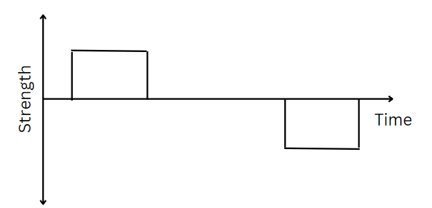
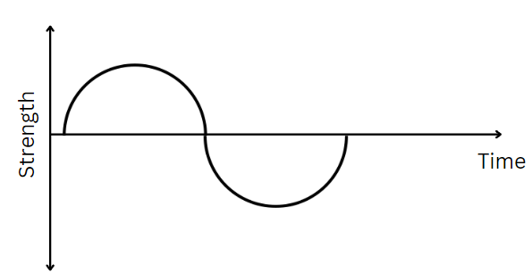
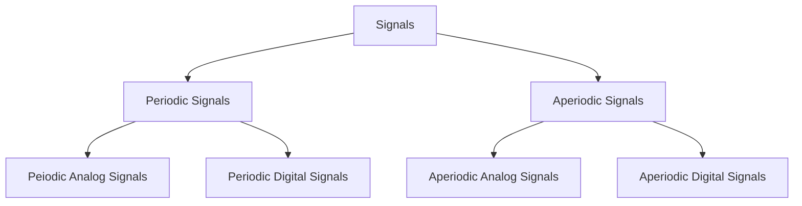

# Introduction to Signals

## What is a signal?

- A signal is a physical quantity that varies with time, space or any other independent variable or variables.
- A signal is a function of one or more independent variables, which contain some information.
- Data is encoded in the form of signals and transmitted from one point to another.

## Types of Signals

1. **Digital Signals**: A digital signal is a signal that represents data as a sequence of discrete values; at any given time it can only take on one of a finite number of values.

**Figure 1: Digital Signal**

1. **Analog Signals**: An analog signal is any continuous signal for which the time varying feature (variable) of the signal is a representation of some other time varying quantity, i.e., analogous to another time varying signal.

**Figure 1: Analog Signal**

## Another Classification of Signals

1. **Periodic Signals**: A signal is said to be periodic if it repeats itself after a fixed interval of time. The smallest interval of time after which the signal repeats itself is called the period of the signal.

2. **Aperiodic Signals**: A signal is said to be aperiodic if it does not repeat itself after a fixed interval of time.

