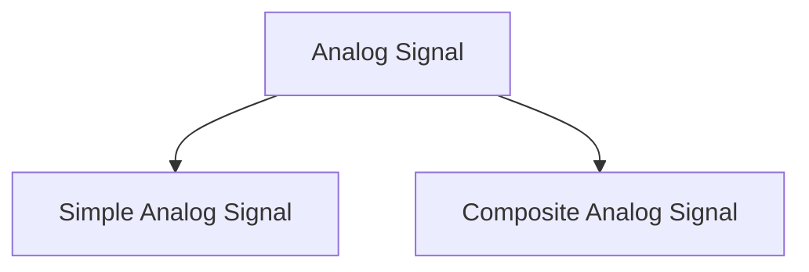

# Analog Signal

## Simple Analog Signal

**Figure 1: Simple Analog Signal**

- A simple analog signal is a continuous function of time that conveys information.

## Three Parameters of Simple Analog Signal

1. **Amplitude**: The amplitude of a signal is the maximum absolute value of the signal.
   - We can say it measure of the strength of the signal at a given time.
   - It can be measured in volts, amperes, watts, etc.

2. **Frequency**: The frequency of a signal is the number of cycles per second.
   - It is measured in hertz (Hz).
   - The inverse of frequency is called the period of the signal.
   - Period is the time required to complete one cycle, measured in seconds.
  
| Frequency | Period |
| --------- | ------ |
| 1 Hz      | 1 s    |
| 2 Hz      | 0.5 s  |
| 1 KH      | 1 ms   |
| 1 MH      | 1 us   |
| 1 GH      | 1 ns   |
| 1 TH      | 1 ps   | 

3. **Phase**: The phase of a signal is the position of the signal relative to time zero.
   - It is measured in degrees or radians.

**Figure 2: Phase of a signal**

- Phase = 0&deg; or 360&deg; or 0 rad or 2 $\pi$ rad

- Phase = 90&deg; or $\frac{\pi}{2}$ rad

- Phase = 180&deg; or $\pi$ rad

- Phase = 270&deg; or $\frac{3\pi}{2}$ rad

## Q. Frequency and Period for the following signal

- There is no change in signal. So, frequency is 0 Hz and period is $\infty$.

## Q. If Sine wave is offset by $\frac{1}{6}$ cycle, what is the phase of the signal?

- Phase = $\frac{1}{6}$ cycle = $\frac{1}{6}$ $\times$ 360&deg; = 60&deg;
- Phase = $\frac{1}{6}$ cycle = $\frac{1}{6}$ $\times$ 2 $\pi$ rad = $\frac{\pi}{3}$ rad

4. **Wavelength**: The wavelength of a signal is the distance occupied by one cycle on the transmission medium.
   - It is measured in meters.
   - $\lambda$ = $\frac{v}{f}$, where v is the velocity of the signal in the medium and f is the frequency of the signal.
   - $\lambda$ = c $\times$ T, where c is the speed of light and T is the period of the signal.

**Figure 3: Wavelength of a signal**

## Composite Analog Signal

- A composite analog signal is a combination of simple analog signals.

- We must try to plot Frequency domain plot of the signal to understand the signal better and also it is easy to analyze the signal in frequency domain.

**Time Domain Plot**

**Frequency Domain Plot**

**Frequency Spectrum**
- It is the collection of all frequencies a composite signal contains.
- For above the Frequency Spectrum = {2,3}

**Bandwidth**
- The bandwidth of a composite signal is the difference between the highest and the lowest frequencies contained in that signal.
- For above the Bandwidth = 3 - 2 = 1 Hz

## Note:-
> Bandwidth of Simple analog signal is 0 Hz.
