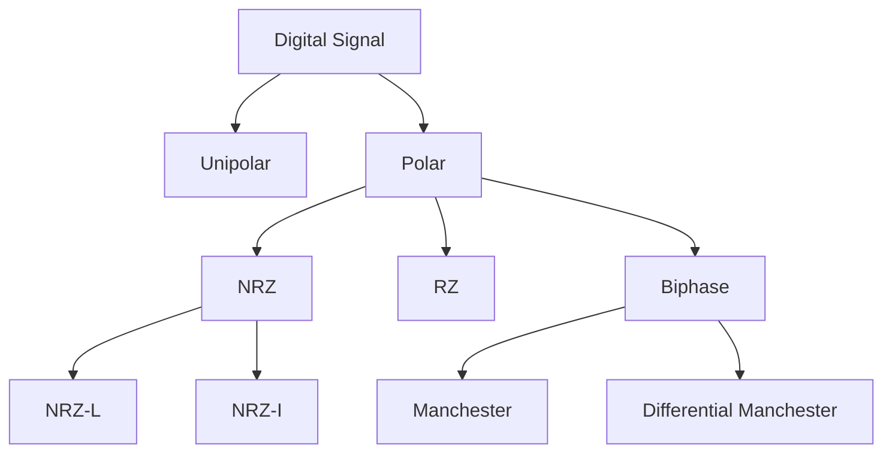
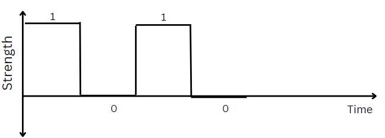
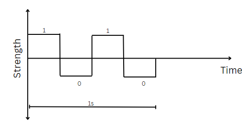

# Digital Data to Digital Signal

## Unipolar

- All Signal levels are on one side of the time axis, either positive or negative.

## Polar

- Signal levels can be on both sides of the time axis, positive or negative.

## Unipolar NRZ

- Here we consider 1 as positive voltage and 0 as zero voltage.
- The signal level does not change during the bit interval.
- The signal level changes only at the beginning of the bit interval.

**Figure**

**DisAdvantages**

1. **DC Compomnent:** We want D.C. component to be 0. $\because$ wires can carry those digital signals whose net power is 0.

2. **Synchronization:** Synchronization of continuous 1s & 0s is problem.
   - $\because$ if there are continuous 1s or 0s, then the receiver will not be able to detect the start of the next bit.

## Polar NRZ-L

- Here we consider 1 as positive voltage and 0 as negative voltage.
- The signal level changes only at the beginning of the bit interval.
- The signal level does not change during the bit interval.

**Figure**

**DisAdvantages**

1. **DC Component:** We can have non-zero DC component if both voltages are not equal.

2. **Synchronization:** Synchronization of continuous 1s & 0s is problem.
   - $\because$ if there are continuous 1s or 0s, then the receiver will not be able to detect the start of the next bit.

## Polar NRZ-I

- Here we consider 1 as change in voltage and 0 as no change in voltage.
- The signal level changes only at the beginning of the bit interval.
- The signal level does not change during the bit interval.

**Figure**

- Here we have taken initial state to be +ve, we can also take initial state to be -ve.

**DisAdvantages**

1. **DC Component:** We can have non-zero DC component.

2. **Synchronization:** Synchronization of continuous 1s & 0s is problem.
   - Problem of continuous 1s will not be there as everytime there will be change in voltage.
   - But problem of continuous 0s will be there as everytime there will be no change in voltage.

# GATE 2006
In NRZ-I technique synchronization of continuous 1s is not a problem but synchronization of continuous 0s is a problem.  
4B/5B technique uses NRZ-I technique it guarantees that data must not contain 3 continuous 0s.  
Data is divided into 4 bit blocks or datawords & each dataword  is replaced by 5 bit codeword. So in place of sending data words use send codeword & these codewords are designed in such a way that 3 continuous 0s will never occur.  
**Q. Codewords have atmost 1 leading 0 & atmost 1 trailing 0. How many such codewords are possible?**
- Suppose both end has 0
  - 0 _ _ _ 0 $\rightarrow$ 2 ways
    - As both ends have zeros so we need their beside places to be 1.
    - Only one place left to fill so $\binom{2}{1}$ ways.
  - 0 _ _ _ 1 $\rightarrow$ 4 ways
    - As left end is 0 so first place will be 1.
    - Only two places left to fill so $\binom{2}{1} \times \binom{2}{1}$ ways.
  - 1 _ _ _ 0 $\rightarrow$ 4 ways
    - As right end is 0 so fourth place will be 1.
    - Only two places left to fill so $\binom{2}{1} \times \binom{2}{1}$ ways.
  - 1 _ _ _ 1 $\rightarrow$ 8 ways
    - As both ends are 1 so we can fill any place with 1.
    - All three places left to fill so $\binom{2}{1} \times \binom{2}{1} \times \binom{2}{1}$ ways.
- Hence, total ways = $2 + 4 + 4 + 8 = 18$ ways.