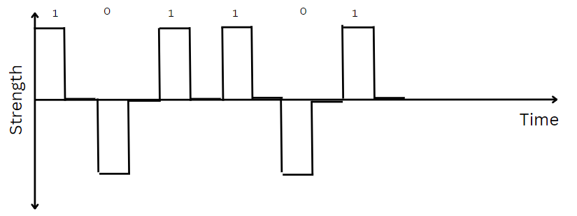
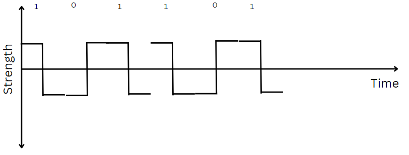
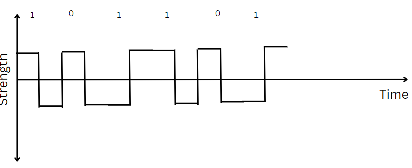

# RZ Technique (Return to 0)

- Here 1 is represented as Z and zero is represented as backwards-z.
- Return to 0 means in the middle of bit we return to zero.

**Figure**  

**Advantages**
- It has better synchronization.

**Disadvantages**
- It has some non-zero DC component.

# Manchester Encoding 

- Notations same as RZ, but instead of returning to zero goes to opposite direction.

**Figure**  

**Advantages**
- It has better synchronization.
- It has zero DC component.

> According to IEEE standard we have 0 as z and 1 as barkwards-z.

# Differential Manchester Encoding

- Here, one means change in shape and zero means no change in shape.
- Start with any shape z or backwards-z.

**Figure**  

**Advantages**
- It has better synchronization.
- It has zero DC component.

