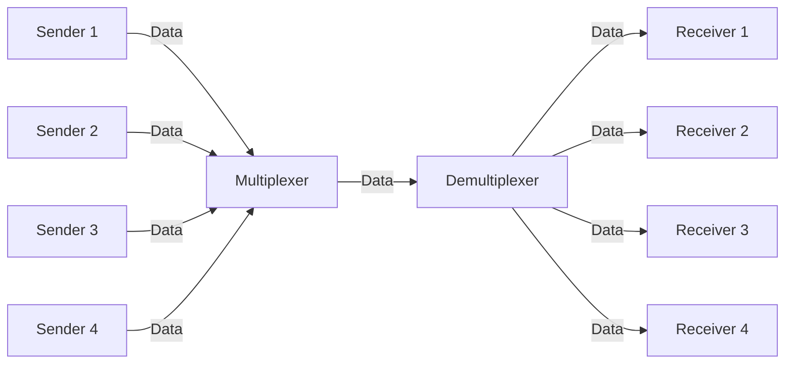
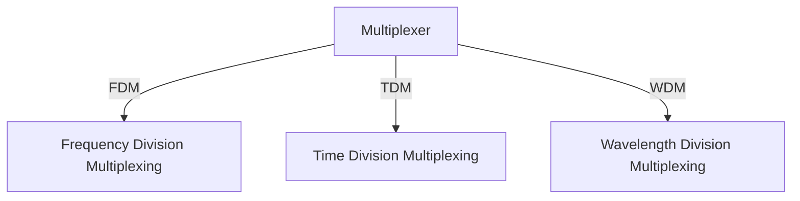

# Multiplexing at the Physical Layer

- Set of techniques that allows multiple signals to be transmitted over a single link at the same time.

## Types of Multiplexing

## Frequency Division Multiplexing (FDM)

- Each sender is assigned a different frequency band.
- The frequency bands are non-overlapping.
- The link is divided into frequency bands, e.g. one band has frequencies from 0 to 100 kHz, another from 110 to 210 kHz, etc. In between the bands, there are guard bands to prevent interference.
- It is used in analog transmission.

## Question
- Each station is sending data at frequency 100kHz & we have 5 stations. What is the bandwidth required for FDM, given that guard band is 10kHz?

## Solution
- Total bandwidth required = 500kHz + 40kHz = 540kHz

## Wavelength Division Multiplexing (WDM)

- Each sender is assigned a different wavelength.
- In fiber optics, the light is divided into different wavelengths.
- The wavelengths are non-overlapping.
- Prism is used to separate the light into different wavelengths.

> In Electric signals, FDM is used.  
> In Fiber optics, WDM is used.  
> In Digital signals, TDM is used.

## TDM (Time Division Multiplexing)

- Each sender is assigned a different time slot.
- Channel is divided on the basis of time i.e. a particular time slot is assigned to each sender where it is allowed to use the entire bandwidth.
- **Assumption:** 
  - Each sender is sending data at the same rate.
  - Data flow of each sender is divided into packets of equal size called **Data Units**.
  - Data unit can be one bit, one byte, one character, etc.
- Data is transmitted in form of frames via link.
- Each frame has m slots and each slot can carry one data unit.

## Types of TDM

## Synchronous TDM

- Number of slots in each frame is equal to the number of senders.
- If sender does not want to send data, then corresponding slot is left empty.

## Asynchronous TDM (Statistical TDM)

- Number of slots in each frame is not equal to the number of senders. They actually less than the number of senders.
- If at any instant of time there are more than 'm' stations who want to send data then we have backlogs.

## Efficiency of TDM

- Efficiency of TDM is defined as the ratio of the number of data units that can be transmitted in a given time to the total number of data units that can be transmitted in the same time if each sender is given a dedicated link.
- If there are 'n' senders and each sender is sending data at the same rate, then efficiency of TDM is given by:
  - E = n / (n + m)
  - where, m is the number of slots in each frame.

- If time needed to transmit one data unit is 'T.T.', first bit of data unit reach receiver in 'T.P. + T.T.' time.
  - E = T.T. / (T.P. + T.T.)
  - We can also say that as
  - E = Useful Cycle / Cycle Time 

## GATE 2007
- Statistical TDM, Number of Sources = 10, In a time unit source sends 1000 bits. No. of sources sending data for 1st 20 time units is 6,9,3,7,2,2,2,3,4,6,1,10,7,5,8,3,6,2,9,5. Output Capacity of MUX is 5000 bits/sec. Then average number of packet backlogs per minute during given period is?

### Solution
- Total number of sources = 10
- Packet size = 1000 bits
- Output capacity of MUX = 5000 bits/sec
- O/P capacity suggest that at one time frame how much data can be transmitted.
  - From this we can say that each frame has 5000/1000 = 5 slots.
- Number of backlogs = 1 + 5 + 3 + 5 + 2 + 0 + 0 + 0 + 0 + 1 + 0 + 5 + 7 + 7 + 10 + 8 + 9 + 6 + 10 + 10 = 89/20 = 4.45

## GATE 2005
- TDM, Length of each time slot is time to transmit 100 bits + end to end propagation delay. If speed of signal = 2 * 10^8 m/sec, length of link = 1km & Bandwidth = 10 Mbps. Maximum number of stations in LAN such that throughput of each station = 2/3 Mbps.

### Solution
- Propagation delay = $10^3 / 2 * 10^8 = 5 * 10^-6$ sec = 5 microseconds
- Transmission delay = $100 / 10 * 10^6 = 10 * 10^-6$ sec = 10 microseconds
- Efficieny of TDM = T.T. / (T.P. + T.T.) = 10 / (5 + 10) = 2/3
- Throughput = Efficiency * Bandwidth = 2/3 * 10 Mbps = 6.66 Mbps
- Given Throughput of each station = 2/3 Mbps
- Maximum number of stations = 6.66 / (2/3) = 10