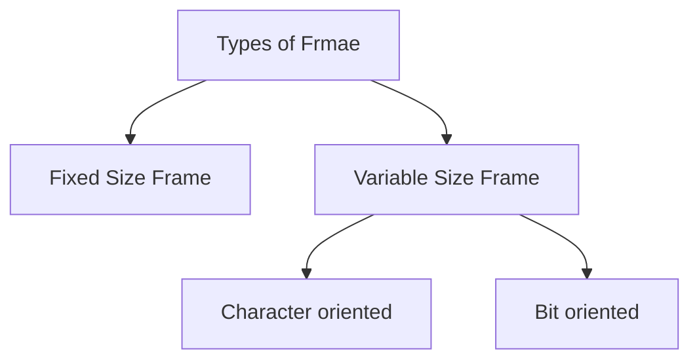

# Framing

- At DLL packets are known as frames.
- DLL add Header and trailer to the dataframe received from the network layer and resulting packet is called frame.

## Types of Frame

- Fixed Size Frame
  - All frames are of same size.
  - Example: ATM
  - No need to specify start and end of frame.
- Variable Size Frame
  - Frames are of variable size.
  - Example: Ethernet
  - Need to specify start and end of frame.

**Figure**
```
|Start of Frame|Header|Message|Trailer|End of Frame|
```

## Character Oriented Approach
- Entire frame is multiple of 8 bits i.e. data is used as Header & Tralier are multiple of 8 bits.
- Flag is special character of 8 bits which added at the start and end of frame which gives information about frame boundaries.
- If flag appears in the data then byte stuffing is used i.e. another special character called escape character is added before flag and hence receiver will interpret the flag as data.
- If Escape character appears in the data then it must be escaped by another escape character.
- If both flag and escape character appears in the data then one escape character for each is added.
- This technique was used mainly to send ASCII text messages & not used nowadays.

## Bit Oriented Approach
- Similar to byte oriented approach, flag character is used to detect frame boundaries.
- Flag character is 01111110.
```
|01111110|Header|Message|Trailer|01111110|
```
- If flag appears in the data then bit stuffing is used i.e. after 5 consecutive 1's a 0 is added and receiver ignore that zero to interpret the flag as data.
- This is genrally used nowadays. Used for text, audio, video, etc.
- Example:
  - If data is 01111110, then data sent $\rightarrow$ 011111010
  - If data is 011111010, then data sent $\rightarrow$ 0111110010
  - Zero after 5th 1 will be ignored by receiver.

