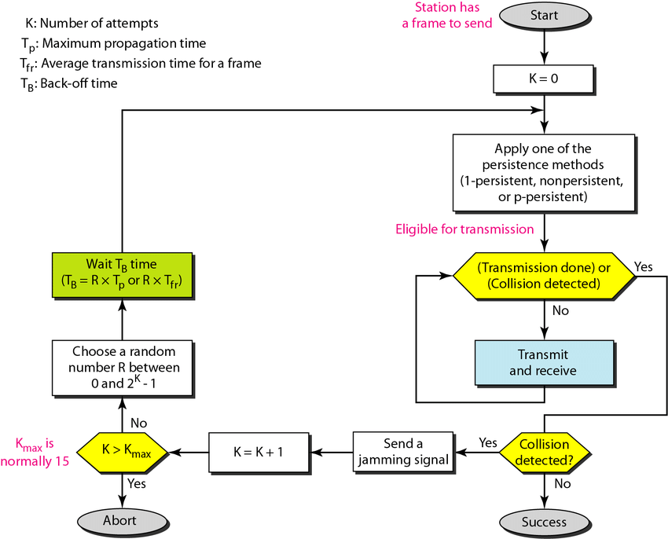
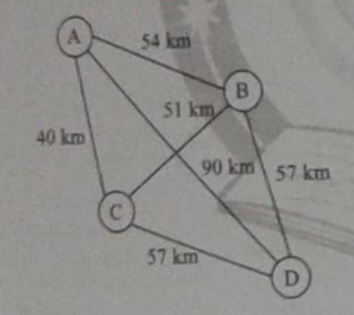

# CSMA/CD (Collision Detection)

- CSMA doesn't specify procedure following collision i.e. if 2 stations sense the channel to be idle & begin transmitting at the same time, then collision will occur and still stations will continue to transmit.
- Better way to save time & B/W is to detect the collision and immediately stop transmission this strategy is used in CSMA/CD.
- Here station has two ports sending port and listening port. Sending port is used to transmit the data and listening port is used to check if collision has occurred or not. Both the processes are done simultaneously.
- If collision is sensed by the station then it will stop sending data and will transmit a jamming signal to all the stations to stop transmitting.

## Observations

1. **NO ACK** : There is no need of ACK, because if collision is not detected then the frame has been received successfully.
   - This MAC layer does not take care of error detection or packet loss as it is the responsibility of the LLC(Logical Link Control) layer.
2. **No Copy** : Station does not maintain copy of the frame at MAC layer, so if collision is not detected then the frame has been received successfully.
3. **Minimum Frame Duration** : Minimum frame duration must be 2 * $T_p$, this is because first bit from sender take $T_p$ time to reach the receiver if just before reaching the receiver if collision occurs then it will take another $T_p$ time to reach the sender. So, minimum frame duration must be 2 * $T_p$ so that it can detect collision as detection and transmission are done simultaneously.
   - Minimum frame Size = Bandwidth * Minimum Frame Duration = $2 * T_p * Bandwidth$.  

## FLowchart

How Collisions are detected?
1. Zero level: Channel is idle
2. Normal level: One of the station successfully captured the channel
3. Abnormal Level: Collision has occured signal strength is doubled.

# Numericals

## Q1
From $k^{th}$ consecutive collision, each colliding station waits for random time choosen from interval ____.

### Solution
- Random time means we are talikng about exponential backoff.
- For $k^{th}$ collision, the range of random time is $[0, 2^k - 1]$

## Q2
A network uses CSMA/CD protocol with B/W of 10 Mbps. If R.T.T. is 51.2 $\mu s$  then what is minimum frame size?

### Solution
Minimum Frame Size = B/W * Minimum Frame Duration  
Minimum Frame Duration = 2 * Tp = RTT = 51.2 $\mu s$  
Minimum Frame Size = 10 Mbps * 51.2 $\mu s$ = 512 bits = 64 bytes  
So if we want to send data of 50 bytes then we need to add 14 bytes of padding.

## Q3
In CSMA/CD network running at 1 Gbps, over 1 km cable, signal speed in cable is 200000 km/s. Find minimum frame size.

### Solution
Tp = 1 km / 200000 km/s = 5 $\mu s$  
Minimum Frame Size = 1 Gbps * 5 $\mu s$ * 2 = 10,000 bits = 1250 bytes

## Q4
A network consists of 4 hosts distributed as shown  

Assume this network uses CSMA/CD & Signal travels with speed of 3 * 10^5 km/s. If sender sends at 1 Mbps then what is minimum frame size?

### Solution
Tp = 90 / 3 * 10^5 = 0.3 $\mu s$  
MFS = B/W * 2 * Tp = 1 Mbps * 2 * 0.3 $\mu s$ = 0.6 $\mu s$ = 600 bits = 75 bytes

## Q5
Suppose nodes A & B are on the same 10 Mbps Ethernet segment & propogation delay b/w 2 nodes is 225 bit times. Suppose A & B send frames at t=0, the frame collide then at what time they finish transmitting a Jam Signal. Assume 48 bit Jam signal.

### Solution
- Tp = 225 bit times, $10^7$ bits in 1 sec, so 1 bit time = 1 / $10^7$ sec. $\therefore$ Tp = 225 / $10^7$ sec = 22.5 $\mu s$
- Both stations data will collide at Tp/2 time and both will come to know about collision at Tp time.
- Now after Tp time both will transmit Jam Signal.
- Transmission Time for Jam Signal = 48 / $10^7$ sec = 4.8 $\mu s$
- So, both will finish transmitting Jam Signal at Tp + 4.8 $\mu s$ = 27.3 $\mu s$ or 273 bit times.

## Q6
Suppose nodes A and B are attached to 2 opposite ends of the table with Tp = 12.5 ms. Both nodes attempt to transmit at t=0. Frames collide after 1st collision, A draws k=0 & B draws k=1 in backoff protocol. Ignore the Jam signal. At what time in second, is A packet completely delivered at B if B/W = 10 Mbps & packet size = 1000 bits.

### Solution
- A waits for 0 * RTT = 0s  
- B waits for 1 * RTT = 12.5 * 2 * 10^-3 = 25 ms  
- Transmission Time = 1000 / 10 * 10^6 = 100 $\mu s$ = 0.1 ms  
- Collision was detected when both data collided at Tp/2 = 6.25 ms, now after Tp/2 time both will come to know about collision and stop sending data.  
- Also A has to wait more Tp time from this point as the last bit which A sent will take Tp time to reach B, so that the whole channel is free.
- So, A will transmit after 25 ms of time.  
- Again after transmitting it will take Tt + Tp time to reach B i.e. 0.1 ms + 12.5 ms = 12.6 ms.
- Total time = 25 ms + 12.6 ms = 37.6 ms.

## GATE 2004
Consider a simplified time slotted LAN protocol where each host always has data to send & transmits with probability p=0.2 in every slot. There is no backoff & one frame can be transmitted in one slot. If more than one host transmits in the same slot, then all the transmissions fail. What is the maximum number of hosts this protocol can support if each host has to be provided a minimum throughput of 0.16 frames per time slot?

### Solution
- Probability of success = throughput of n stations= 0.16
- 0.16 * n = n * p * $(1-p)^{(n-1)}$
  - 0.16 = p * $(1-p)^{(n-1)}$
  - 0.16 = 0.2 * $(0.8)^{(n-1)}$
  - 0.8 = $(0.8)^{(n-1)}$
  - n = 2

## GATE 2013
Data rate = 500 Mbps in Ehternet LAN. Frame Size = 10,000 bits. Signal Speed = 200,000 km/s. Find maximum length of the cable.

### Solution
We know that for detecting collision, minimum frame size must be 2 * Tp * B/W.  
Tp = Distace/Speed = L/200,000  
10,000 = (2 * L * 500 *$10^6$)/200,000  $\Rightarrow$ L = 2000 m = 2 km

## GATE 2015
Data Rate = 100 Mbps, Length = 1km, Minimum Frame Size = 1250 bytes. Find Signal Speed?

### Solution
1250*8 = 2 * 100 * $10^6$ * $10^{3}$ / Speed  
Speed = 20,000 km/s

## GATE 2018
Consider a simple communication system where multiple nodes are connected by a shared broadcast medium (like Ethernet or wireless). The nodes in the system use the following carrier-sense based medium access protocol. A node that receives a packet to transmit will carrier-sense the medium for 5 units of time. If the node does not detect any other transmission, it starts transmitting its packet in the next time unit. If the node detects another transmission, it waits until this other transmission finishes, and then begins to carrier-sense for 5 time units again. Once they start to transmit, nodes do not perform any collision detection and continue transmission even if a collision occurs. All transmissions last for 20 units of time. Assume that the transmission signal travels at the speed of 10 meters per unit time in the medium.  

Assume that the system has two nodes P and Q, located at a distance d meters from each other. P start transmitting at t=0 after successfully completing its carrier-sense phase. Node Q has a packet to transmit at time t =0 and begins to carrier-sense the medium.  

The maximum distance d (in meters, rounded to the closest integer) that allows Q to successfully avoid a collision between its proposed transmission and P’s ongoing transmission is _______.

### Solution
- P starts transmitting and Q starts checking now Q while checks P's data must reach Q's checkpoint so that it comes to recognize that P is transmitting.
- So Q's checkpoint must be at a distance of 5 * 10 = 50 m from Q.

## Efficiency of CSMA

$\eta$ = $\frac{Useful \; time}{Cycle \; time}$  
Useful time is as usual Transmission Time.  
For successful packet transfer Station has to attempt e times.  
Cycle time = (TT + Tp) + (e * 2 * Tp)  
- First bracket is for packet sent and reached successfully.
- Second is for checking if collision has occured or not.  

$\eta$ = $\frac{1}{1 + 6.44 * a}$  

## Question
B/W = 10Mbps of Ethernet LAN, Distance = 2.5km, Speed of Signal = 2.3 * $10^8$ m/s, Packet Size = 128 Bytes out of which 30 bytes are overhead. Find Efficient Transmission Rate?

### Solution
- Transmission Time = 128 * 8 / 10 * $10^6$ = 102.4 $\mu s$
- Tp = 2.5 * $10^3$ / 2.3 * $10^8$ = 10.87 $\mu s$
- a = $\frac{10.87}{102.4}$ = 0.106
- $\eta$ = $\frac{1}{1 + 6.44 * a}$ = $\frac{1}{1 + 6.44 * 0.106}$ = 59%
- Throughput = 59% * 10 Mbps = 5.9 Mbps
- As 30 bytes were overhead so we need not consider it in Transmission Time.
  - $\therefore$ Efficient Transmission Rate = 5.9 Mbps * (128 - 30) / 128 = 4.52 Mbps

