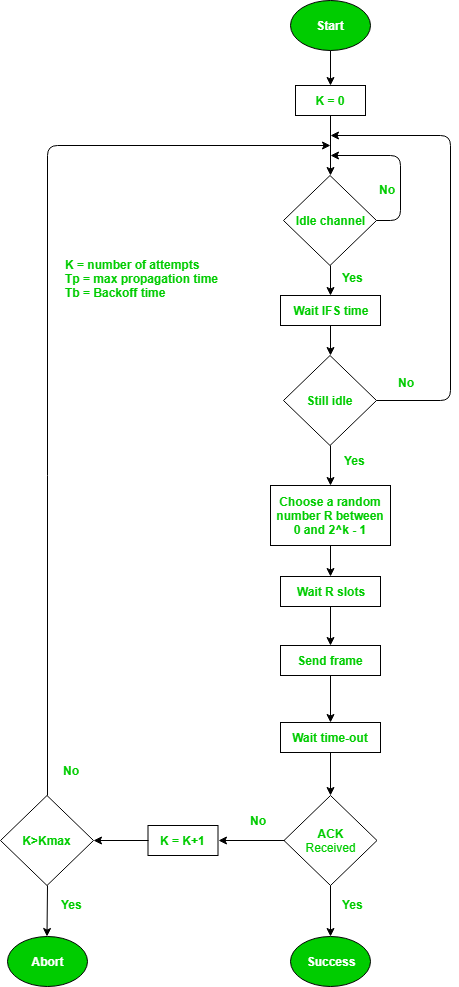

# CSMA/CA (Collision Avoidance)

- CSMA/CD works only on wired networks. Because over their attenuation is very low, so the collision can be detected easily.
- But in wireless networks, the attenuation is very high, so the collision can't be detected easily. Hence here CSMA/CA is used.
- Here our motive is to avoid collision.
- CSMA/CA has three strategies to avoid collision:
  - Interframe Space (IFS)
  - Contention Window (CW)
  - Acknowledgement (ACK)

## Interframe Space (IFS)
- In CSMA/CA if channel is busy the station will keep on sensing it but as soon as the channel is idle it will not send data immediately. It will wait for some time. This time is called Interframe Space (IFS).
- IFS time is the time needed for a signal to reach the given station from the farthest station in the network.
- This protocol assumes that even though the channel may appear idle when it is sensed, a distant station may have already started transmitting.
- It gives Priority to the stations.

## Contention Window (CW)
- It is an amount of time divided into slots of Transmission Time Units (TTUs).
- After IFS time station does not transmit data immediately rather it waits for a random amount of time. This random amount of time is called Contention Window (CW).
- This random number is chosen according to backoff strategy.
- Only empty slots are counted as the number of slots station waited for.

## Acknowledgement (ACK)
- With all these precautuions there are still chances of collision. Hence a positive ACK and time out timer can help guarantee that the data is received.

## Flowchart

| Acknowledgements| Protocols |
| :---: | :---: |
| ✅ | Aloha |
| ✅ | Slotted Aloha |
| ❌ | CSMA/CD |
| ✅ | CSMA/CA |