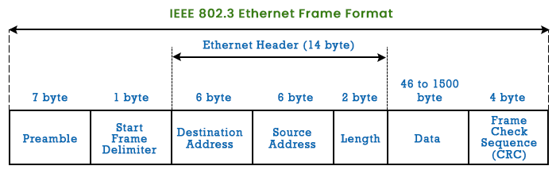

# Ethernet

- IEEE started 802 project, so that different LANs can be interconnected.
  - IEEE 802.1 $\rightarrow$ Bridged LANs
  - IEEE 802.2 $\rightarrow$ LLC
  - IEEE 802.3 $\rightarrow$ Ethernet
  - IEEE 802.4 $\rightarrow$ Token Bus
  - IEEE 802.5 $\rightarrow$ Token Ring
  - IEEE 802.7 $\rightarrow$ DQDB
  - IEEE 802.11 $\rightarrow$ WLAN

- In Ethernet signal is broadcasted by the sender hence every station on LAN receives it.
- Ether uses CSMA/CD with 1-persistence method

## Ethernet Evolution
- Standard Ethernet $\rightarrow$ 10Mbps
- Fast Ethernet $\rightarrow$ 100Mbps
- Gigabit Ethernet $\rightarrow$ 1Gbps
- 10 Gigabit Ethernet $\rightarrow$ 10Gbps

## IEEE 802.3 MAC Frame Format

- **Preamble:** Alternating sequence of 1s and 0s
  - It warns the receiver about frame is going to arrive hence used for synchronization.
- **SFD(10101011):** It is the last warning to the receiver that frame is going to arrive.
  - Last two 1s tells the receiver that next field is going to be destination address.
- **Length/type:** Type field used in original ethernet which gives info about which higher layer(LLC) protocol is using MAC frame.
  - But IEEE standardized LANs since we have only one protocol i.e. PDU(Protocol Data Unit) at LLC. So IEEE modified this field to length field.
  - Length field tells only length of data not frame.
  - As length field is of 16 bits but data has got some restrictions so minimum length shows 46 bytes and maximum length shows 1500 bytes.
- As CSMA/CD works on ethernet, and we studied for detection minimum frame size has to be sent i.e. 46 bytes. So if data is less than 46 bytes then padding is done.
- Preamble and SFD is not part of frame, those are added by Physical layer.
- So minimum layer of MAC frame is 64 bytes and maximum is 1518 bytes.

## Addressing in Ehternet
- Hexadecimal Notation is used & after each byte colon( : ) is used as a separator.
- First 3 bytes are OUI(Organizationally Unique Identifier) and last 3 bytes are NIC(Network Interface Card) identifier.
- 3 types of addresses are used in ethernet:
  - **Unicast:** First byte last bit is 0
  - **Multicast:** First byte last bit is 1
  - **Broadcast:** All bits are 1s
- In Broadcast all stations within LAN receives the frame, not the stations outside the LAN.

### Example
- AB:12:36:E2:45:36 $\rightarrow$ Multicast
  - B = 1011 $\rightarrow$ Last bit is 1
- 36:42:96:87:AF:12 $\rightarrow$ Unicast
  - 6 = 0110 $\rightarrow$ Last bit is 0
- FF:FF:FF:FF:FF:FF $\rightarrow$ Broadcast