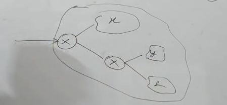

# VLSM (Variable Length Subnet Maksing)

- Suppose there are three organizations in where one need 128 addresses and rest two needs 64 addresses. In this case we will use VLSM.
- First we breack the class C block into two parts of 128 and 128. Next we break 128 block into two parts i.e. 64 and 64.

## Example 
IP = 200.40.50.0 | Break it into 3 orgs one requiring 128 addresses and rest two requireing 64 addresses.

### Solution
- First break the block into 2 parts each making 128 hosts
- Subnets are:
  - 200.40.50.0 - 200.40.50.127
  - 200.40.50.128 - 200.40.50.255
- Now first part will be given to one org and next part again break it into 2 parts for rest two orgs
- 2nd Layer Subnets are:
  - 200.40.50.128 - 200.40.50.191
  - 200.40.50.192 - 200.40.50.255
- There can be 4 ways of doing this partition
  1. Discussed above
  2. interchange allocation at level 2
  3. Interchange allocation of initial 128 block which will again create 2 possibilities like above 2.

## Question
To give class C block among 4 organisations such that the parts are 128,64,32,32.

### Solution
- Two ways to give 128 block
- Then, two ways to give 64 block
- Then, two ways to give 32 block
- Then, one block left for 32
- Total = 2\*2\*2\*1 = 8
- Blocks:
  - 200.40.50.0 - 200.40.50.127
  - 200.40.50.128 - 200.40.50.191
  - 200.40.50.192 - 200.40.50.223
  - 200.40.50.224 - 200.40.50.255

## Question
Class B block: 140.41.0.0 shared among 5 orgs, such that parts are $2^{15},2^{13},2^{13},2^{13},2^{13}$

### Solution
- One half block for the 15 one rest half will be divided into two parts
- Subnets are:
  - 140.41.0.0 - 140.41.127.255
    - 0 00 00000.00000000 - 0 11 11111.11111111
  - 140.41.128.0 - 140.41.159.255
    - 1 00 00000.00000000 - 1 00 11111.11111111
  - 140.41.160.0 - 140.41.191.255
    - 1 01 00000.00000000 - 1 01 11111.11111111
  - 140.41.192.0 - 140.41.223.255
    - 1 10 00000.00000000 - 1 10 11111.11111111
  - 140.41.224.0 - 140.41.255.255
    - 1 11 00000.00000000 - 1 11 11111.11111111
- Here gaps, first bit is used for dividing the whole part into two
- Next two bits are used to divide the later half part into 4 parts

## Question
Class A block is to be divided among orgs where they get addresses like $2^{22},2^{22},2^{22},2^{20},2^{20},2^{21}$

### Solution
- Class A provides $2^{24}$ we initially only we divide the block into 4 parts
- Giving three parts to those who require $2^{22}$ addresses.
- In the remaining now first we divide the block into 2 parts
- Again one of the later half will be divided into 2 parts.
- Done ✅

## Routing in VLSM

- Apart from site router there is always one router placed whenever we break the part.
- Let class C block 200.40.50.0 with parting in 128,64,64 be there
- Subnet Mask of internal Router 1: 255.255.255.128
- Subnet Mask of internal Router 2: 255.255.255.192
- Now, if more internal divisions are there then it will increase the number of routers in the network.
- We can do this in single router by expanding the table

### Table
| Mask | Output | Port |
| ---- | ------ | ---- | 
| 255.255.255.128 | 200.40.50.0   | 1 |
| 255.255.255.192 | 200.40.50.128 | 2 |
| 255.255.255.192 | 200.40.50.192 | 3 |