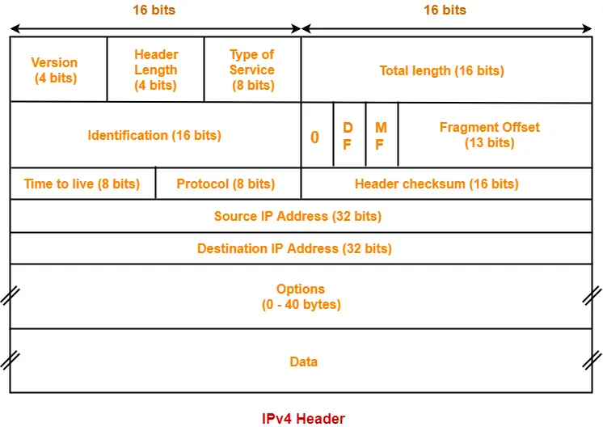

## IP Protocol
- It is unreliable & connectionless
  - Unreliable: No error checking or Tracking
  - Header contains a field called checksum but it is not for checking data, it is for checking the header.
- Provides the best effort delivery system.
- Each Datagram can be transported seperately and can follow different routes.
- IP is basically a unicasting protocol.

## IP Datagram
- Total Datagram Size (20 - 65535)
- Two parts
  1. Header (20 - 60)
  2. Data   (0 - 65515)
- Datagram is packed inside a frame
- If datagram is packed in Ethernet frame then maximum size will be 1500 bytes of data, as ethernet carries max of 1518 byte of data from which 18 bytes is for header.
- Minimum data requirement of Ethernet frame is 46 bytes but we can send 20 byte(As 20 is the minimum datagram size of IP) of data and adding 26 byte of padding to the data.
- Hence, Maximum padding done by Ethernet Layer is of 26 bytes.

## IP Header

- First 5 rows make up 20 bytes which is the minimum datagram size required by IP.
- VER(4 bits): tells the version of the IP.
  - Like IPv4, IPv6, etc.
- HLEN(4 bits): Defines the Header Length
  - 0101 * 4 = 20 bytes
  - 1111 * 4 = 60 bytes
  - Minimum number is 0101 as minimum size is 20 bytes.
  - Also, Header length is always multiple of 4.
- Service Type(8 bits): 
  - First three bits decide the Priority
    - 000 is the Least Priority
    - 111 is the Highest Priority
  - 4th Bit(D): Delay
  - 5th Bit(T): Throughput
  - 6th Bit(R): Reliability
  - 7th Bit(C): Cost
    - If we require minimum delay: 1000
    - Maximum Througput: 0100
    - Min Delay & Max Reliabilty: 1010
    - Max Throughput and Min Cost: 0101
  - 8th Bit: Future Use
- Total Length(16 Bits):
  - Header Length + Data Length
  - Used because we need to differentiate data and padding
- TTL(8 bits):
  - When TTL becomes zero it destroys the packet. Happens in the case when packet is lost or stuck in loop.
  - TTL is set by the sender.
  - After every hop the TTL field is reduced by router or the receiver.
- Protocol(8 bit):
  - Which upper layer protocol is using the datagram
  - ICMP (1): 00000001
  - IGMP (2): 00000010
  - TCP (6), UDP (17)
- Header Checksum(16):
  - Error Detection scheme for header only
  - Done by ICMP
  - Header checksum is processed 2 times at a router, one when it is arrived and second after procesing when it is to be sent, again header checksum is calculated, updated and sent.
  - Updation in checksum happens due to the TTL and some other fields, changes in hops.

## Question
First 30 bits of IP datagram are 01000110100... what is header Length?

### Solution
- 0110: 6*4 = 24 bytes

## Question
TTL field value is 8, How many router it can travel and how many routers it can cross?

### Solution
- Travel: 8
- Cross: 7

## Question
Which fields are changed by router when it receives IP datagram

### Solution
- TTL, Header Checksum [Always]
- Protocol, VER, TOS, ID, DIP [Never]
- Options, Total Length, Fragment offest, SIP(Changes in the case of NAT) [Maybe] 