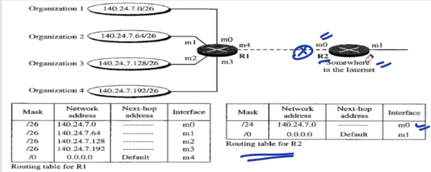
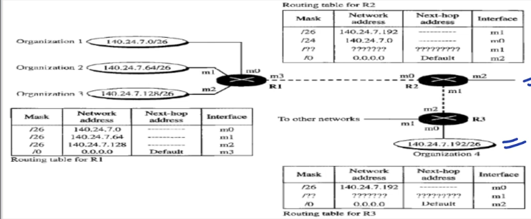

## How to fill the routing table

- Suppose a router R1 is connected directly to 4 networks [ 180.70.65.128/26, 201.4.16.0/22, 180.70.65.192/27, 201.4.22.0/24 ] and one port connects to router which is connected to the rest of the internet[ 180.70.65.200 ].
- The table is feild according to the longest mask matxhing technique means network with longest net ID comes first.
- Table entries:

| Mask | Net ID | Next hop | Interface/Port |
| ---- | ------ | -------- | -------------- |
| /27  | 180.70.65.192 | - | m2 |
| /26  | 180.70.65.128 | - | m0 |
| /24  |  201.4.22.0   | - | m3 |
| /22  |  201.4.16.0   | - | m1 |
|  /0  |    0.0.0.0    | 180.70.65.200 | m2 |

- The last entry is for the remaining packets of the internet, look the main router is connected to some network and in that netwrok there is a router which is connected to the internet.
- Suppose want to send packet to 180.70.65.140
  - First mask with /27, Net ID: 180.70.65.128
    - Not the required one
  - Second mask with /26, Net ID: 180.70.65.128
    - Required one, packet forwarded to m0
- Packet with ID: 201.4.22.35
  - Firtst two tried, ofcourse no match
  - Third try with /24, Net ID: 201.4.22.0
    - Required one, packet forwarded through m3
- Packet with ID: 180.24.32.0
  - Tried first four no matching
  - Matched with fifth, sent through port m2
    - Also next hop is mentioned so it will go to the router connected to the internet.

## Why Longest Mask Matching?

- Here we can see 4 organizations having /26 nets are connected to internal router which is later connected to internet router.
- Now since we need to reduce the entries of the table, if aggregation of entries is possible we aggregate them, as done in table of R2.

- Now if any of the org move to other network as shown above, we need to add other entry for it.
- Now, still the Net ID will match with aggregated entry if it is checked first.
- Due to this reason we do matching by longest mask first.

## GATE 2014
An IP router implementing classless Inter-domain Routing receives a packet with address 131.23.151.76. The router's routing table has the following entries:  
| Prefix | Outer Interface Identifier |
| ------ | -------------------------- |
| 131.16.0.0/12 | 3 |
| 131.28.0.0/14 | 5 |
| 131.19.0.0/16 | 2 |
| 131.22.0.0/15 | 1 |
The identifier of the output interface on which this packet will be forwarded is ___.

### Solution
- AND with /16, Net ID: 131.23.0.0
- AND with /15, Net ID: 131.22.0.0
- AND with /14, Net ID: 131.22.0.0
- AND with /12, Net ID: 131.16.0.0
- Now, it matched with two entries but one with higher mask length will have priority so answer is interface 1.
- Option 4.

## GATE 2015
Consider the following routing table at an IP router;
| Network No. | Net Mask | Next Hop |
| ----------- | -------- | ------- |
| 128.96.170.0 | 255.255.254.0 | Interface 0 |
| 128.96.168.0 | 255.255.254.0 | Interface 1 |
| 128.96.166.0 | 255.255.254.0 |     R2      |
| 128.96.164.0 | 255.255.252.0 |     R3      |
|    0.0.0.0   |    Default    |     R4      |

For each IP address in Group I identify the correct choice of the next hop from Group II  using the entries from the routing table above.

| Group 1 | Group 2 |
| ------- | ------- |
| i) 128.96.171.92  | a) Interface 0  |
| ii) 128.96.167.151 | b) Interface 1 |
| iii) 128.96.163.151 | c)     R2     |
| iv) 128.96.164.121 |  d)    R3      |
|                |  e)        R4      |
1. i-a,ii-c,iii-e,iv-d
1. i-a,ii-d,iii-b,iv-e
1. i-b,ii-c,iii-d,iv-e
1. i-b,ii-c,iii-e,iv-d

### Solution
- i) AND with /23, Net ID: 128.96.170.0
  - Matched so with interface 0
- ii) AND with /23, Net ID: 128.96.166.0
  - Matched so with R2
- iii) AND with /23, Net ID: 128.96.162
  - Not Mtached
  - AND with /22, Net ID: 128.96.160
  - Not Matched
  - Will go through through default R4
- iv) AND with /22, Net ID: 128.96.164
  - Matched and through R3
- Option (A)

## GATE 2004
The routing table of a router is shown below:
| Destination | Subnet Mask | Interface |
| ----------- | ----------- | --------- |
| 128.75.43.0 | 255.255.255.0 | Eth0 |
| 128.75.43.0 | 255.255.255.128 | Eth1 |
| 128.12.17.5 | 255.255.255.0 | Eth3 |
| Default |  | Eth2 |
On which interface will the router forward packets addressed to destinations 128.75.43.16 and 192.12.17.10 respectively?
1. Eth1 and Eth2
1. 0 and 2
1. 0 and 3
1. 1 and 3

### Solution
- First address
  - AND with /32: 128.75.43.16
  - AND with /25: 128.75.43.0
    - Matched: Eth 1
- Second Address
  - AND with /32: 192.12.17.10
  - AND with /25: 192.12.17.0
  - AND with /24: 192.12.17.0
    - No Match so go with default: Eth2
- Option (A)

## GATE 2006
A router uses the following routing table
| Destination | Subnet Mask | Interface |
| ----------- | ----------- | --------- |
| 144.16.0.0  | 255.255.0.0 | Eth0 |
| 144.16.64.0  | 255.255.224.0 | Eth1 |
| 144.16.68.0  | 255.255.255.0 | Eth2 |
| 144.16.68.64 | 255.255.255.224 | Eth3 |
Packet bearing a destination address 144.16.68.117 arrives at the router. On which interface will it be forwarded?

### Solution
- AND with 27: 144.16.68.96
- AND with 24: 144.16.68.0
  - Matched
- Answer Eth2

## Heirarchical Routing
- Suppose there are 700 routers then there will be entry of each router in a single router.
  - So, Total entries: 700*700 = 490000
- Now, if we make region of each router
  - Suppose each region contains of 10 routers.
  - We will now have 69 regions.
  - Each router will now have 69 entries of each region + 10 entries of each router in the region(To know which router is connected to which region)
  - Number of Entries: 700*79 = 55,300
- Now, suppose we make clusters each containing 10 regions
  - We now will have 7 clusters
  - Each router will now contain: 10 entries for each router in region + 9 entries of each region + 6 entries of ither clusters
  - Total Entries of each router: 25
  - Total entries: 700*25 = 17,500

## Formulas
- Number of entries in each router: No. of routers in region + (Number of Regions - 1) + (Number of Clusters -1)
- Total Number of Entries: Total Number of entries * No. of entries for each router.

## Geographical Routing
To decrease the size of the routing table even further, we need to extend hierarchical routing to include geographical routing. We must divide the entire address space into a few large blocks. We assign a block to North America, a block to Europe, a block to Asia, a block to Africa, and so on. The routers of ISPs outside Europe will have only one entry for packets to Europe in their routing tables. The routers of ISPs outside North America will have only one entry for packets to North America in their routing tables. And so on.