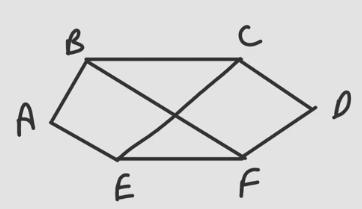
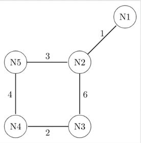
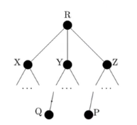
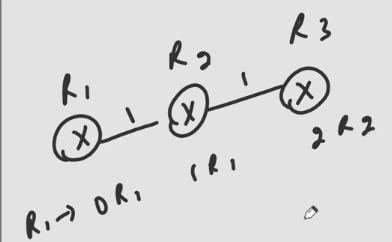
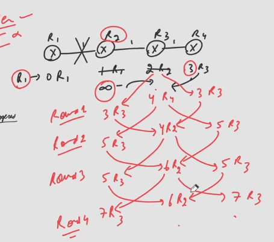

## Distance Vector Routing
- It is based upon Bellman ford Algorithm.
- It was original ARPANET routing algorithm.
- It was also used in internet under the name RIP.
- Initially every router has idea about total number of routers in the Network.
- Weight on edge can be distance, No. of hops, delay, etc.
- Each router maintains a table in which the fields are "To" "Cost" & "Next".
- The number of entries is equal to the number of routers in the network.
- Since, It is a type of distributive algorithm so learning is always done from neighbours
- Periodically each router share cost column [Distance Vector] of its table with all it's neighbours only.
- Entire table is not shared rather cost column is shared.
- ```
    D --- C
    | \   |
    |   \ |
    A --- B
    ```
- Cost D-C:11, C-B:3, A-B:2, A-D:1, B-D:7
- Routing Tables:

D
| To | Cost | Next |
| -- | ---- | ---- |
| A  |  1   |   A  |
| B  |  7   |   B  |
| C  |  11  |   C  |
| D  |  0   |   D  |

C

| To | Cost | Next |
| -- | ---- | ---- |
| A  |  inf |   -  |
| B  |  3   |   B  |
| C  |  0   |   C  |
| D  |  11  |   D  |

A

| To | Cost | Next |
| -- | ---- | ---- |
| A  |  0   |   A  |
| B  |  2   |   B  |
| C  |  inf |   -  |
| D  |  1   |   D  |

B

| To | Cost | Next |
| -- | ---- | ---- |
| A  |  2   |   A  |
| B  |  0   |   B  |
| C  |  3   |   C  |
| D  |  7   |   D  |

- This table is filled with help of packets called as "Hello packets".
### After first table exchange with neightbours
D gets new vales:  
C: inf,3,0,11 & A: 0,2,inf,1  
C: inf,13,11,22 & A: 1,3,inf,2  
D's updated table:

| To | Cost | Next |
| -- | ---- | ---- |
| A  |  1   |   A  |
| B  |  3   |   A  |
| C  |  11  |   C  |
| D  |  0   |   D  |

C's updated table after getting values from D & B  

| To | Cost | Next |
| -- | ---- | ---- |
| A  |  5   |   B  |
| B  |  3   |   B  |
| C  |  0   |   C  |
| D  |  10  |   B  |

B's updated Table after getiing values from C, A & D.   
C: inf,3,0,11 D: 1,7,11,0 A: 0,2,inf,1   
C: inf,3,3,14, D: 8,7,18,7 A: 2,2,inf,3

| To | Cost | Next |
| -- | ---- | ---- |
| A  |  2   |   A  |
| B  |  0   |   B  |
| C  |  3   |   C  |
| D  |  3   |   A  |

A's updated Table after getting values from D & B.

| To | Cost | Next |
| -- | ---- | ---- |
| A  |  0   |   A  |
| B  |  2   |   B  |
| C  |  5   |   B  |
| D  |  1   |   D  |

### After Second Table exchange with neighbours
- This time the updated cost vectors will be changed

D gets value from A & C  
A: 0,2,5,1 C: 5,3,0,10  
A: 1,3,6,1 C: 16,14,11,10  
D's updated table

| To | Cost | Next |
| -- | ---- | ---- |
| A  |  1   |   A  |
| B  |  3   |   A  |
| C  |  6   |   A  |
| D  |  0   |   D  |

At C  
D: 1,3,11,0 B: 2,0,3,3  
D: 12,14,11,11 B: 5,3,3,6 

| To | Cost | Next |
| -- | ---- | ---- |
| A  |  5   |   B  |
| B  |  3   |   B  |
| C  |  0   |   C  |
| D  |  6   |   B  |

B's Table 

| To | Cost | Next |
| -- | ---- | ---- |
| A  |  2   |   A  |
| B  |  0   |   B  |
| C  |  3   |   C  |
| D  |  3   |   A  |

A's Table

| To | Cost | Next |
| -- | ---- | ---- |
| A  |  0   |   A  |
| B  |  2   |   B  |
| C  |  5   |   B  |
| D  |  1   |   D  |

### After third exchange with neighbours

D's Table

| To | Cost | Next |
| -- | ---- | ---- |
| A  |  1   |   A  |
| B  |  3   |   A  |
| C  |  6   |   A  |
| D  |  0   |   D  |

C's Table

| To | Cost | Next |
| -- | ---- | ---- |
| A  |  5   |   B  |
| B  |  3   |   B  |
| C  |  0   |   C  |
| D  |  6   |   B  |

B's Table

| To | Cost | Next |
| -- | ---- | ---- |
| A  |  2   |   A  |
| B  |  0   |   B  |
| C  |  3   |   C  |
| D  |  3   |   A  |

A's Table

| To | Cost | Next |
| -- | ---- | ---- |
| A  |  0   |   A  |
| B  |  2   |   B  |
| C  |  5   |   B  |
| D  |  1   |   D  |

- All these table are same as previous exchange tables so we can say that no more exchanges are needed.

## Question
Which edge will be never used?

### Solution
- From D there are routes only to A, so no usage of DC and DB edge.
- Same from B no path to D, from C no path to D.

## Note
> If packet is not sent by D via DB then B will also not send the packet to D via BD. The links here are symmetric or can say two ways that's why if one side doesn't send via that link, other side will use the same other path used by first side.

## Important Points
- If we have 'n' routers in the Network then n-1 steps or rounds are needed by every router to crack their table.
- In 1st step, 1 edge is involved.
- In 2nd step, 2 atmost edges are involved.
- In (n-1)th step, atmost (n-1)edges are involved.
- Since, DVR is a kind of Adaptive [Dynamic] Routing algorithm so it won't stop even after (n-1) steps rather routers keep on exchanging tables periodically because some router may fail pr link may go down, etc.

## Question
Distance Vector routing is used, and the following vectors have just come in to router C: from B: (5,0,8,12,6,2); from D: (16,12,6,0,9,10); and from E: (7,6,3,9,0,4). The measured delays to B,D, and E, are 6,3, and 5, respectively. What is C's new routing table? Give both the outgoing line to use and the expected delay.  


### Solution
C's Table

| To | Delay | Line |
| -- | ----- | ---- |
| A  |  11   |  B   |
| B  |  6    |  B   |
| C  |  0    |  C   |
| D  |  3    |  D   |
| E  |  5    |  E   |
| F  |  8    |  B   |

## Question (UGC-NET)
Distanc vector routing algorithm is a dynamic routing algorithm. The routing tables in distance vector routing algorithm are updated ____ .
1. automatically
2. by server
3. by exchanging information with neighbour nodes
4. with back-up database

### Solution
- Option C.

## GATE 2011
The network uses a DVR protocol. Once the routes have been stabilized, the distance vectors at different nodes are as follows.  
N1: (0,1,7,8,4)  
N2: (1,0,6,7,3)  
N3: (7,6,0,2,6)  
N4: (8,7,2,0,4)  
N5: (4,3,6,4,0)  
Each distance vector is the distance of the best known path at that instant to nodes, N1 to N5, where the distance to itself is 0. Also, all links are symmetric and cost is identical in both directions. In each round, all nodes exchange their distance vectors with their respective neighbours. Then all nodes update their distance vectors. In between two rounds, any change in cost of a link will cause the two incident nodes to change only that entry in their distance vectors. The cost of link N2 - N3 reduces to 2. After next round of updates what will be the distance vector at node, N3?


### Solution
- N2 will give table: (1,0,2,7,3)
- Now after updating link distance N3 will have: (3,2,2,9,5) from N2.
- Therefore, N3 table will be now: (3,2,0,2,5)

## Question Continued
After the update in the previous question, the link N1-N2 goes down. N2 will reflect this change immediately in its distance vector as cost inf. After the NEXT ROUND of update, what will be the cost to N1 in the distance vector of N3?

### Solution
- 10, due to the table received from N4 will have value 8 to reach N1.

## GATE 2021
Consider a computer network using the dvr algorithm. The partial topology of the network is shown below.  
  
The objective is to find the shortest-cost path from router R to routers P and Q. Assume that R does not initially know the shortest routes to P and Q. Assume that R has three neighbouring routers denoted as X, y and Z. During one iteration, R measures it's distance to its neighbours X, Y and Z as 3, 2 and 5, respectively. Router R gets routing vectors from its neighbours that indicate that the distance to router P from routers X,Y and Z are 7,6 and 5, respectively. The routing vector also indicates that the distance to router Q from routers X,Y and Z are 4,6 and 8. Which of the following statement(s) is/are correct with respect to new routing table of R, after updation during this iteration?
1. The distance from R to P will be stored as 10.
2. The distance from R to Q will be stored as 7.
3. The next hop router for a packet from R to P is Y.
4. The next hop router for a packet from R to Q is Z.

### Solution
- Option 2,3 are correct

## Question
Distance vector routing works as
1. optimal cost finally converges to estimated cost after series of message exchange
2. estimated cost finally converges to optimal cost after series of message exchange
3. Estimated message will never converge to optimal cost.
4. None

### Solution
- Option B

## Type of Updates
- There are two type of updates
  1. Periodic Updates (Studied till now)
  2. Triggered Updates
    - Any change in table, don't wait for periodic update time, just share immediately the updated changed table with the neighbours.

## Count to infinity Problem
- Suppose below is the situation and table entries for r1 are shown.  

- Now if link b/w R1 and R2 is broken updated entries will be 
  - R1: 0 R1, R2: inf -, R3: 2 R2
- Now, according to type of updates discussed above, change in entry of table in R2 will fire triggered update, hence updated table of all will be:
  - R1: 0 R1; R2: inf -; R3: inf -;
- This is the situation that triggered updated happened before periodic update.
- If periodic update happens before triggered update then, updated table will be
  - R1: 0 R1; R2: 3 R3; R3: 4 R2;
  - R1: 0 R1; R2: 5 R3; R3: 6 R2;
- Upon every exchange there value will increase, this causes count to infinity problem.

## If no triggered updates
- If only periodic updates are done still it will encounter count to infinity problem
  - R1: 0 R1; R2: inf -; R3: 2 R2;
  - R1: 0 R1; R2: 3 R3; R3: inf -;
  - R1: 0 R1; R2: inf -; R3: 4 R2;
  - R1: 0 R1; R2: 5 R3; R3: inf -;
- So on...

## 4 Routers Count to infinity


## Problem due to count ot infinity
- Due to this problem, the packet roams from one place to other and then back again to first place. This process goes on upto infinite time and congestion increases.

## Solution
1. Defining Infinity:
   - The first solution is to redefine to a smaller number such as 16. As a matter of fact, most implementations of the DVR define 16 as infinity. However, this means that distance vector cannot be used in large systems. The size of network, in each direction, can not exceed 15 hops.\
2. Split Horizon:
   - In this strategy, instead of flooding the table through each interface, each node sends only part of its table through each interface. If, according to its table, node B thinks that the optimum route to reach X is via A, it does not need to advertise this piece of information to A; the information has come from A(A already knows). Taking information from node A, modifying it, and sending it back to node A is what reates the confusion.
   - This works in case of 2 nodes misunderstanding, if there is 3 nodes misunderstanding connected in a triangle, it will not work.
3. Poison Reverse:
   - When a route fails, do not wait for next periodic update. Instead send an immediate triggered update listing the poisoned route & all the routers which receives this update will broadcast the same so that all routers get knowledge about poisoned route as fast as possible.
4. Split Horizon with Poison Reverse:
   - Using the split horizon strategy has one drawback. Normally, the DVR uses a timer, and if there is no news about a route, the node deletes the route from its table. When node B in the previous scenario eliminates the route to X from it's adverstisement to A, node A cannot guess that this is due to the splithorizon strategy or because B has not received any news about X recently. The split horizon strategy can be combined with the poison reverse strategy. Node B can still advertise the value for X, but if the source of information is A, it can replace the distance with infinity as a warning: "Do not use this value; what I know about this route comes from you."
  - This works in case of 2 nodes misunderstanding, if there is 3 nodes misunderstanding connected in a triangle, it will not work.