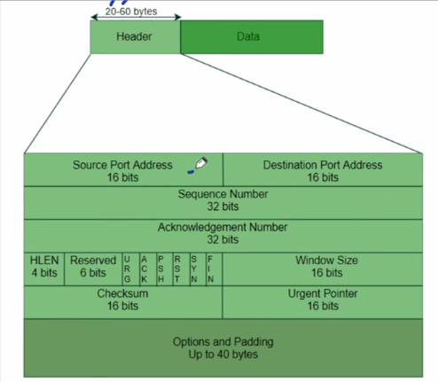
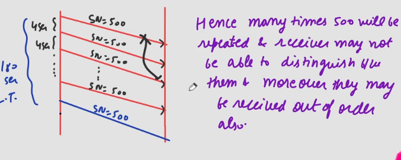

## Transmission Control Protocol
- It is connection oriented and reliable protocol.
- TCP works in full-Duplex mode.
- TCP is byte stream protocol i.e. every byte of data is numbered but IP is packet stream protocol i.e. every packet [ Datagram ] is numbered [ID field].
- Unlike UDP, TCP can be used to send large messages i.e. chopping of large message into segments can be done by TCP.
### Connection
- It is virtual connection & not physical i.e. segments of TCP may follow different paths, some of them may lost or duplicated or arrive out of order because they are encapsulated in IP datagram.
- Resources like buffer are allocated to client and server in advance before starting transmission.
- The buffers used are circular buffers.
### Reliable
- TCP has both flow and error control.
- For flow control there will be byte oriented sliding window protocol.

## TCP Header ⭐
- Minimum 20 bytes and maximum 60 bytes.  

- Source Port address 16 bit field used to identify application program in host sending the segment.
- Destination Port address 16 bit field used to identify application program in host receiving. the segment.
### Sequence Number
- 32 bit field
- As TCP is byte-oriented so every byte transmitted is numbered.
- Sequence number is the byte no. of 1st byte carried in the segment.
  - Suppose a 5 byte data is sent in a segment, each byte having numbers 500,502,502,503,504
  - Now the sequence number will be byte number of first byte i.e. 500.
- TCP works in full duplex mode i.e. both parties can send data to each other.
- During connection establishment both parties uses random number generator to create Initial sequence no., which is usually different in each direction.
  - Random because, if everytime we start with let's say 0, and data of 50 bytes is sent.
  - First segment has seq: 0
  - Second has seq: 50
  - Third has seq: 100, but this got lost
  - Fourth has seq: 150
  - No third ACK would have come so resent third with seq: 100
  - Now connection is terminated.
  - Again both process communicate for some other purpose.
  - Again numbering start with 0, data of 50 bytes.
  - Two packets accepted by receiver.
  - This time if that seq: 100 packet which got lost came to receiver, it cannot differentiate whether it is new or old one.
  - Due to this sequence numbers are generated randomly.
- Since Sequence Number is of 32 bits so $2^{32}$ numbers are possible.
- Since each byte is numbered so max data that can be sent is 4GB & even if sender wnats to send 1 more byte then for that byte we have to reuse the byte number i.e. wrap around will occur.
### Wrap Around Time
- Time needed to use same byte number which is already used.
- It depends on Bandwidth.
### LifeTime of Packet
- Life time of packet in Internet is genrally 3 min.
- Which means in worst case lost packet can arrive at receiver in 3 min.
- If wrap around time is more than Life time then no issue will be there because until the same packet number chance come to be used meanwhile the old packet will be destroyed, so receiver can differentiate the packets.
- But if wrap around time is not more than Life time than another packet carrying other data but with same sequence number can come to receiver and receiver may mistake it as previous required segment.
  - Here Problem of duplicacy occurs.  

### Solution to Less Wrap around time problem
1. Decrease Bandwidth: Not a good solution as user want more & more Bandwidth.
2. Increase No. of bits to label bytes: Not possible as S.N. is fixed i.e. 32 bits but still we can use 32 bit option called timestamp for this purpose & hence now we have 32+32=64 bits to label the bytes.
   - Extra MSB goes to timestamp option
   - LSBs go to Seq no.
   - Ex: 34 00110....11
     - 00 goes to timestamp
     - 110...11 goes to Seq no.
### Acknowledgement Number
- Last byte no. carried in segment +1
- **Problem:** How will receiver calculate ACK no as there is no field in TCP header which states length of segment.
  - It takes help of IP header
  - Payload length of IP = TL - HLEN(packet)*4
  - Payload length of segment = Payload of IP - HLEN(segment)*4
  - ACK no.: (SeqNo. + P.L. -1) + 1 $\rightarrow$ SeqNo. + P.L.
### Header Length
- Same as IP header
### Reserved
- 6 bit field reserved for future use.
### Control
- This field defines 6 different control bits or flags.
- URG: Urgent
- ACK: Acknowledgement
- PSH: Request for Push
- RST: Reset the connection
- SYN: Synchronize sequence Numbers
- FIN: Terminate the connections
- You are perfect reliable sincere friend
### Window Size
- This field defines size of window in bytes that other party must maintain.
- 16 bit field, so max window size can be 65,535 bytes.
- This is normally determined by the receiver, for receiving window size.
- Suppose sender sends segment and sets window size to 400, it means when receiver responds to sender then receiver must send data not more than 400 Bytes.
### Checksum
- 16 bit field.
- Checksum calculation same as UDP.
- For TCP pseudoheader protocol value is 6.
- Here inclusion of checksum is mandatory.
### Urgent Pointer
- Valid when URG flag is set.
- 16 bit field.
- Used when the segment contains urgent data.
- It defiens number that must be added to sequence number to obtain the number of last urgent byte in the data section of the segment.
### Options
- Upto 40 bytes optional info in TCP header.

## Question
Application program need to send 5000 bytes data, TCP divide it into 5 segments of equal size. Initial sequence number is 10,000. Find sequence number of 3rd segment. Also find ACK no. sent by receiver after receiving 2nd segment.

### Solution
- 5000 bytes data in 5 segments so each segment contain 1000 bytes.
- Initial sequence number is 10,000 so, first packet will have sequence number 10,001 and second segment will have sequence number 11,001 and Third segment will have sequence number 12,001.
- ACK number is byte number of last byte in segment + 1: Therefore ACK no. after receiving 2nd segment is 12,001.

## Question
If ACK No. is 'x' in TCP then this means receiver has received __ bytes.
1. x
2. x+1
3. x-1
4. none

### Solution
- As studied in last receiver sends ack of next expected number.
- But the sequence numbers are randomized so we can't say that if receiver ask for 12001 then 12000 bytes are received by the receiver.
- Hence answer will be none.

## Question
If ACK No. is 'x' and ISN is y in TCP then this means receiver has received __ bytes.
1. x-y
2. x-y-1
3. x-y+1
4. none

### Solution
- As studied in last receiver sends ack of next expected number.
- Here ISN is y which is initial randomized number, so we need to subtract that.
- Answer: x-y-1
  - If ISN:100
  - First segment: 101-200
  - Second segment no.: 201 (ACK after first)
  - Bytes received = 201-100-1 = 100 bytes

## Question
If ACK No. is 'x' and First segment no. is y in TCP then this means receiver has received __ bytes.

### Solution
- x-y because here it is talked about first segment not the ISN (establishment number).

## Question
Message: 1000 bytes. TCP send 4 segments of 100,200,400 & 300 bytes. Byte No. of 1st byte is 5000. What is ACK no. sent by receiver after receiving 3rd segment.

### Solution
- First segment: 5000 - 5099
- Second Segment: 5100 - 5299
- Third Segment: 5300 - 5699
- Forth Segment: 5700 - 5999
- ACK no. after receiving 3rd segment is 5700

## Question
If Bandwidth is 8mbps. Find Wrap around Time for TCP.

### Solution
-  $8 \times 10^{6}$ bits per second
-  $1 \times 10^{6}$ bytes per second
-  The wrap around will occur after sending 4GB data.
-  Thereofre, wrap around time: $\frac{2^{32}}{10^{6}}$ = 4294.9 seconds.

## GATE 2018
Consider a long lived TCP session with an end-to-end bandwidth of 1 Gbps. The session starts with sequence no. 1234. The minimum time(rounded to closest integer) before this sequence number can ne used again?

### Solution
- As discussed Wrap-around time depends upon Bandwidth
- We have 32 bits in sequence number, so we can give $2^32$ sequence numbers at max.
- Given 1 Giga bits per second, so need to divide by 8 to get Giga Bytes per second
- Answer: $\frac{2^{35}}{10^{9}}$ = 34.36 seconds
- Answer: 35 to closest integer, we took ceil value here as 34.3 is the least time required so to closest integer the time must be more than that.

## Question
How many extra bits are needed for SN if B/W is 1GBps & LT is 3 min.

### Solution
- Wrap around time if B/W is 1 GBps
  - 4 seconds
- We need at time more than 180 seconds
- if 1 bit increased
  - 8GB/1GBps
  - WAT: 8 seconds
- if 2 bits increased
  - WAT: 16 seconds
- if 5 bits increased
  - WAT: 128 seconds
- if 6 bits increased
  - WAT:  256 seconds
- Therefore 6 extra bits are needed.
- Other way we need bits to represent number $ 180 \times 10^{9}$
  - Bits required: $2^{y-1}-1 \lt (x-1) \leq 2^{y}-1$
  - y = ceil(log(x)); [base2]
  - y = floor(log(x-1))+1: [base2]
  - y = 38 bits (6 bits extra)

## GATE 2022
Consider the data transfer using TCP over a 1 Gbps link. Assuming that maximum segment lifetime is set to 60 seconds, the minimum number of bits for the sequence number field of the TCP header, to prevent the sequence number space from wrapping around during the MSL is __.

### Solution
- Life time is 60 seconds so wrap around must be more than that.
- In one sec $10^{9}$bits flow, so in 60 seconds $60 \times 10^{9}$ bits flow
  - $7.5 \times 10^{9}$ bytes flow, so we need bits to number all those bytes that we do not encounter wrap around.
- To represent number $\frac{60 \times 10^{9}}{8}$ = $2^{3} \times 2^{30}$ = 33 bits

## GATE 2023 ⭐
Suppose you are asked to design a new reliable byte-stream transport protocol like TCP. This protocol, named myTCP, runs over a 100 Mbps network with Round Trip Time of 150 milliseconds and the maximum segment lifetime of 2 minutes.
Which of the following is/are valid lengths of the Sequence Number field in the myTCP header?
1. 30 bits
2. 32 bits
3. 34 bits
4. 36 bits

### Solution
- In one second $10^{8}$ bits flow
- In 120 seconds, $120 \times 10^{8}$ bits flow
  - $15 \times 10^{8}$ bytes flow = $1500 \times 10^{6}$
- We need to number all of the hence bits required will be $2^{11} \times 2^{20}$ = 31 bits
- Hence we must have minimum 31 bits in sequence header.S
- So answers are 32,34,36 bits

## Question
TL of datagram = 1000, HLEN of datagram = 5, HLEN of segment = 5, SN of segment = 500, ACK no?

### Solution
- Payload of IP = 1000 - 5*4 = 980
- Payload of TCP = 980 - 5*4 = 960
- ACK No: 500 + 960 = 1460