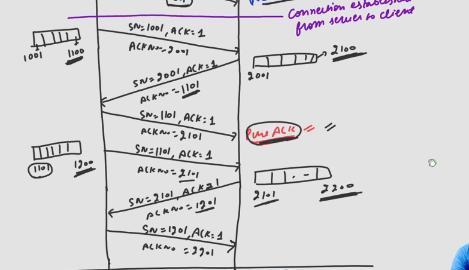

## Data Transfer Phase
- As Server MSS is 500, at client side TCP waits for 500 bytes of data if not sent at once, but if after a certain interval of time if still 500 bytes of data is not collected then TCP sends the packet with the amount of data it has.  

- Let client send 100 bytes of data to the server, SN: 1001, it is same as ACK packet because SN is not consumed by the ACK packet.
- Now server doesn't send ACK immediately after receiving the packet rather it wait for ACK timer, if timer expires then server sends pure ACK else it sends ACK piggybacked with it's data packet.
- Let server want to send 100 bytes of data to client on which ACK is piggybacked, SN: 2001, ACK:1, ACK no:1101 [Becasue Lastbyte no in data was 1100].
- Let client do not want to send data, so it send pure ACK after ACK timer expires, SN:1101 [as expected by server], ACK:1, ACKNo: 2101 [because last byte in data from server was 2100]
- Again after sometime client want to send data then, SN: 1101 reused because pure ACK packet doesn't consume SN and 100 bytes data is sent. ACK:1 & ACKNo: 2101.
- Server send 100 bytes data, SN:2101, ACK:1, ACK No:1201
- Let client doesn't want to send data so it send pure ACK packet, SN:1201, ACK:1, ACK No:2201