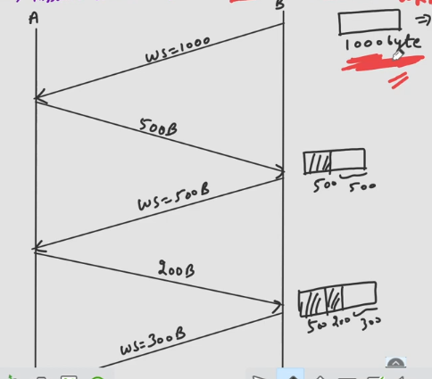

## Flow Control in TCP
- Sender must not send more than what receiver can receive.
- Just like DLL, Transport layer also do flow control by sliding window
- Main difference b/w sliding window of DLL and transport layer is that at DLL it's frame oriented but at Transport layer it's byte oriented.
- Since TCP works in full duplex mode so both A & B have sending and receiving buffer.
- Both A & B's OS, memory, etc. decide their receiving window.
- Sending window is decided based upon the other remote process's receiving window.
  - $W_{Sb} \leq W_{Ra}$
  - $W_{Sa} \leq W_{Rb}$

## Data Transfer
- For simplicity we are here considering simplex mode of transfer from A to B only.  

- B sends packet indicating window size = 1000.
- A sends packet containing data 500B
- B sends ACK with now WS = 500B
- A sends 200 B data
- B sends ACK with now WS = 300B
- A sends 100 B data
- B has meanwhile sent 700 bytes received before to Application Layer.
- B sends ACK with now WS = 900B
- A sends 900 B data
- B sends ACK with now WS = 0B
  - Indicates B saying A to stop sending data
- As soon as TCP sends data t oapplication another ACK from B will go to A with WS = 500B 
- Now, there can be a tricky situation when the ACK sent by B of 500B is lost.
  - A will wait for B to send ACK.
  - B wait for data as it sent ACK.
  - This creates situation of deadlock.
### There is a solution to deadlock
- The solution to this deadlock is persistent timer which is maintained at sender.
- This time starts when S receive from R WS = 0B.
- Generally, value of persistent timer is equal to 1 timeout timer.
- When it expires S send only 1 byte data to R & then R send ACK in which WS = 499. if previous was 500 & communication starts again.
- But if buffer is not free then R will again send WS = 0 & discard that byte.
- When S sends 1 byte data that time it increases timer value exponentially upto some threshold value.
  - Like initial timer was 2, then after one time out it sent 1 byte data and timer set to 4, then 8,16,32,64. 
  - Say 64 is threshold then from now on it will always set value to 64.
- Sender never gives up the connection, it tries again and again.

## Question
Till what time sender will not send data?
### Solution
- Till receiver send ACK in which window size is some positive integer.
- This means that when receiver buffer has got some free space then it send ACK packet in which window size is amount of free space.
## Question
What if ACK is lost?
### Solution
- This situation will lead to deadlock.
- S will keep waiting for that ACK and R will keep on waiting for data packet.

