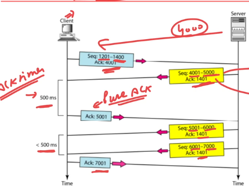
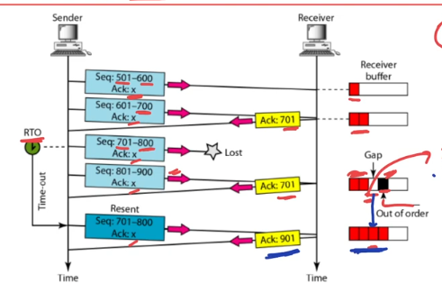
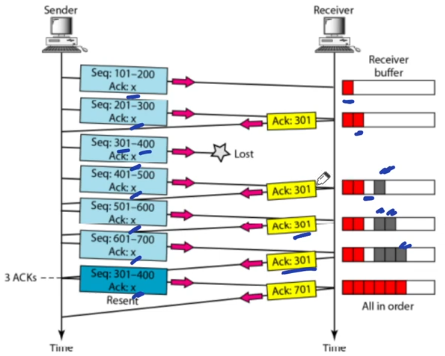

## Retransmission in TCP
- TCP uses combination of GBN & SR
- SR: out of order segments are received
- GBN: ACK are cummulative

## There are two types of Retransmiision
- Retransmission after timeout
- Retransmission after 3 duplicate ACK

## Normal Operation

- First after timeout client sends pure ACK to server.
- Second time after timeout client sends pure cumulative ACK to server for both the packets received.

## Lost Segment Retransmission

- Here the segment 701-800 is lost so when 801-900 segment is received the server sends ACK for 701 as it is not received.
  - Check that the RHS buffer is out of order.
- Now, when client time-out runs off it sends back 701-800 and after getting the packet server sends cumulative ACK of 901.
  - Now buffer is continuously filled so proper ACK is sent.

## Fast Retransmission

- Here one packet in between is missing
- Server sent 3 duplicate ACKs for the missing packet, so if 3 ACKs come then client won't even wait for timeout it will just resend the requested packet.

## Note
> TCP accept out of order delivery but to application layer it gives delivery in order.