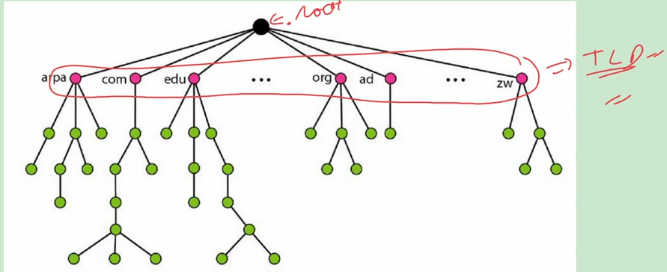
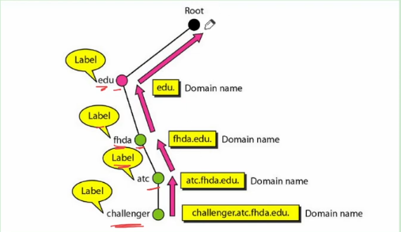
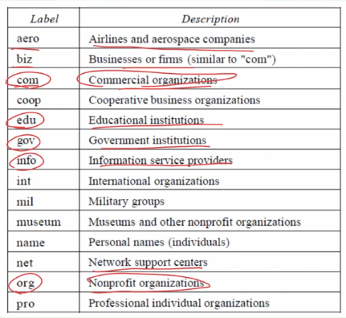
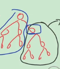
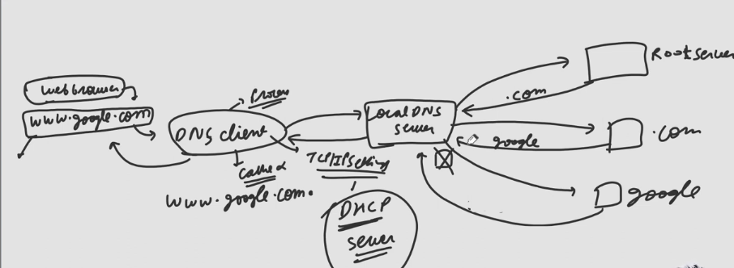

## Domain Name System
- To access information present on computer it was given an IP address.
- But human brain can remember names rather than numbers.
- So each computer is given a unique name and user uses this name to acces information
- Internally this name was mapped to IP address and for this mapping in early days hasts.txt file was used having two columns names and IP addresses.
- We can imagine that this process is similar to phonebook of mobile.
- This file was stored on every host connected to the internet and was periodically updated from master hosts.txt file which was stored at specific computer.
- Today however it is impossible to have one single host file to relate every address with name and vice versa because of two reasons:
  - Size of file will be very large
  - It is impossible to update changes in this file as this change must be broadcast to each and every host.
- Better Solution is to divide this huge amount of information into smaller parts and store each part on different computer.
- Same parts are stored on multiple computers to provide **fault tolerance**.
- Host that need mapping can contact **closest computer** holding that information.
- This method is known as DNS.
- It uses **distributed database** approach.
- It is an application layer protocol and uses **UDP** as transport layer protocol and port Number is **53**.

### Namespace
- We must assign a unique name to each IP address so that mapping become possible.
- Set of all these unique names which are assigned to IP address are called namespace.
#### Types of nameSpace
1. Flat namespace
   - As the name suggests there was **no link** between names and this was used in hosts.txt file
   - But it is very difficult to manage in today Internet as we need a **central authority** which will manage all these names and guanrantee there uniqueness.
2. Hierarchical Namespace
   - Each name is made of several parts.
   - The first part can define nature of organization, second can define the name of organisation and third can define departments in organization and so on.
   - So here Central authority will be responsible for assigning only nature and name of organisation and this organisation itself can assign names to its departments and computer inside departments.
   - So Central authority only **assign part of the name** and not the entire name for example nature is commercial (.com) and name is Cisco.
   - Now Cisco will give name to department like "sales" and give name to computer in slaes department as "abc".
   - Domain name of "abc" computer will be abc.sales.cisco.com
   - Also note that other organisations will also have "sales" department and can have computer name "abc" but as a whole domain name will be unique for example **abc.sales.cisco.com** and **abc.sales.tcs.com**

### Domain Name Space
- To have hierarchical namespace in DNS **domain name space** was designed.
- In this design the names are defined in **inverted tree** structure with the root on the top.  

- The tree can have 128 level each node in a tree has a **label** which is a string of up to 63 characters.
- The root label is Null or empty string.
- DNS requires that children of a node have **different labels** which guanrantee uniqueness of domain names.
- A **domain name** is sequence of labels seperated by dots.
- Domain names are always read from the node up to the root and maximum size can be **255** characters and these are **case sensitive**.
  - Domain name is complete combining all the characters.  

#### Domain name are of two types
1. Fully Qualified Domain Name
   - Domain name which **ends with null string** i.e. dot is called **fully qualified domain name** for e.g. "abc.sales.cisco.com"
   - An FQDN is a domain name that contains the full name of a host.
   - It contains all labels, from the most specific to the most general, that uniquely define the name of the host.
   - For example, the domain name: **challenger.atc.fuda.edu** is the FQDN of a computer named challenger installed at the Advanced Technology Center at De Anza College.
   - **A DNS server can only match an FQDN to an address**.
2. Partially Qualified Domain Name (PQDN)
   - Domain name which **does not ned with null string**.
   - PQDN starts from a node, but it does not reach the root.
   - It is **used when the name to be resolved belongs to the same site as the client**.
   - Here the resolver can supply the missing part, called the suffix, to create an FQDN.
   - For example, if a user at the fhda.edu site wants to get IP address of the challenger computer, he or she can define the partial name **challenger**.
     - We write only abc.sales
     - The resolver itself solves and makes it abc.sales.cisco.com
   - The DNS client adds the suffix atc.fhda.edu. before passing the address to the DNS server.
   - The DNS client normally holds a list of suffixes, from them it adds the suffix.

## Question
How many . can be there at max in domain name

### Solution
- 127
- As there can be maximum 128 levels so, max 127 dots can be there. 

| FQDN | PQDN |
| ---- | ---- |
| challenger.atc.fhda.edu. | challenger.atc.fhda.edu |
| cs.hmme.com. | cs.hmme |
| www.funny.int. | www |

## DNS in Internet
- In internet Domain Name space is divided into three different sections:
   1. Generic Domains
   2. Country Domains
   3. Inverse Domain
- arpa, org, com, in, etc. are Top Level domains.
### Generic Domains
- The genric domains define registered hosts according to their generic behaviour.
- The first level in the generic domains section allows **14 possible labels**.  

### Country Domains
- The country domains section uses two-character country abbreviations. Second labels can be organizational, or they can be more specific, nationl designations.
- The United States, for example, uses states abbreviations as a subdivision of us (ca.us for California in USA.)
- Yet another example can be the address www.amazon.in can be translated to organization amazon in India.
### Inverse Domain
- The inverse domain is used to map address to a name.
- This may happen, for example, when a server has received a request from a client to do a task.
- Although the server has a file that contains a list of authorized clients, only the IP address of the client (extracted from the received IP packet) is listed.
- The server asks its resolver to send a query to the DNS server to map an address to a name to determine the client is on the authorized list.
- This type of query is called an inverse or pointer (PTR) query.
- To handle a pointer query, we have **only one top level domain known as arpa.**
- It was the first domain in DNS. Originally it was called Advance Research Project Agency but now it is called Address and Routing Parameter Area.
- At **second level 2 domains** are used for inverse mapping i.e. **in-addr(for inverse address) and ip6.**
- in-addr is used for IPv4 and ip6 is used for IPv6.

## Distribution of NameSpace
- It means that how this huge amount of information is distributed over servers.
- Part of tree managed by server is called its **zone** and it is always contiguous part of tree.
- We have not stored this entire information at one place to avoid single point of failure and responding request from all over the world places heavy load on system.  

- Look here, the black part of tree will be stored on some other server and blue part on some other server.
  - Black part will be conected to blue by giving root of black some pointer address.

## Types of Servers
1. Non-Authoritative
   - It has **no DNS databse** i.e. it has no entry for IP address and name for any organization
   - It is also known as **cache only server** because to service any query they uses their cache or ask other servers the same query or refer the DNS client to some other server.
   - Example is **Root Server** and it is type of server who's zone is entire DNS tree. Actually it does not store any  information about domain but it sotres the IP address of different servers whose zone is top level domain. There are several root servers in the Internet and all stores same redundant information.
2. Authoritative
   - It has DNS Database and it is of 2 Types
   ### Primary
   - It stores file for a zone for which it is responsible.
   - It is responsible for generating, maintaining and updating this zone file.
   ### Secondary
   - It transfer the complete information about zone from any other server (primary or secondary)  and the file store the file on it's disk.
   - It neither creates nor updates the zone file.
   - If updation is required then it can be done only by primary server and it sent the updated file to all secondary servers.
   - Also note that we can have only one primary server for zone and many secondary servers for the same zone.
   - When the secondary downloads information from primary, it is called **zone transfer** and it is done by **TCP.**

## Working of DNS
- When we type URL in address bar of web browser like www.google.com it is partially qualified domain name (as it does not end with a dot).
- It passes this address to program called **resolver** (DNS Client) and it first convert it into FQDN that is **<u>www.google.com.</u>**.
- Now it will first check in DNS cache that is temporary memory or buffer for the mapping. If entry is present then corresponding IP address is given to web browser. Entry is present if recently web browser has opend that page. This entry is timed out after some time.
- If entry is absent then this resolver will send this query to **local DNS server** (address of the server) is present in TCP/IP settings and is updated by DHCP server when m/c is connected to internet.
- Now this server will first check in its cache if mapping is present then it sends corresponding address to resolver and it sends to web browser.
- But if entry is not present then it will send query to **root server.**
- Root server has IP address of all top level domain servers only so it does not have IP address of www.google.com
- So it will send IP address of server whose domain is .com that is it **partially solve the query.**
- Now local DNS will send query to .com server and it will send IP address of DNS server of Google organization because .com server don't store IP addresses of hosts of Google organisation.
- Now again local DNS server send query to this Google DNS server which has IP address of www, mail, plus, etc hosts of Google and it will send IP address of www.google.com **now it is fully solved.**
- Now query is resolved and local DNS server send reply to resolver and this resolver replies to web browser.  

## DNS Query
- We have 3 types of DNS queries
  1. Reverse loopup query
      - It is used for reverse process i.e. IP to domain name.
  2. Recursive Query
      - When client do this then server has to give **definitive answer** that is if name exists then IP address otherwise error message must be given.
      - DNS server **can't refer client to any other DNS server**
      - Generally recursive queries are sent **end devices to local DNS server.**
      - In above picture, **DNS client to Local DNS Server.**
   3. Iterative Query
      - DNS client allows the DNS server to return **best answer** it may be definitive or not.
      - So now DNS server can send **IP of another DNS server also** and client will request the same query to it
      - For example as seen in working of DNS all 3 queries from local DNS server are iterative queries.
      - This process is also called **walking the tree.**
      - In the above picture, query to root, .com and google server are all iterative queries.

## DNS Answer Types
- There are 4 types of answers given by DNS server to DNS clients.
   1. Negative
      - It is the error message given by server if name does not exists.
   2. Authorative
      - If server give definitive answer after searching from its own database.
      - For e.g. as seen in DNS working, google server reply to our local DNS server.
   3. Non Authorative
      - Reply to query is given by not searching its own database.
      - For e.g. as seen in DNS working, local DNS server reply to resolver.
   4. Referral
      - Answer which give IP of other DNS servers.

## Registrars
- How are new domains added to DNS? This is done through a registrar, a commercial organization accredited by **ICANN.** A registrar first verifies that the requested domain name is unique and then enters it into the DNS database. A fee is charged.
- Today, there are many registrars; their names can be found at http://www/intenic.net
- To register, the organization needs to give the name of its server and the IP address of the server. For example, a new commercial organization named **abc** with a server named **ws** and IP address 200.200.200.5 needs to give the following information to one of the registrars:
  - Domain name: WS.wonderfil.com
  - IP address: 200.200.200.5

## Dynamic Domain Name System (DDNS)
- When the DNS was designed, no one predicted that there would be so many address changes.
- In DNS, when there is a change, such as adding a new host, removing a host, or changing an IP address, the change must be made to the DNS master file.
- These types of changes involve a lot of manual updating.
- The size of today's Internet does not allow for this kind of manual operation.
- The DNS master file must be updated dynamically.
- The DDNS therefore was devised to respond to this need.