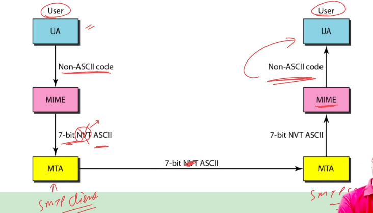
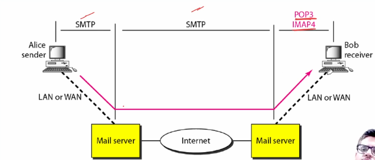
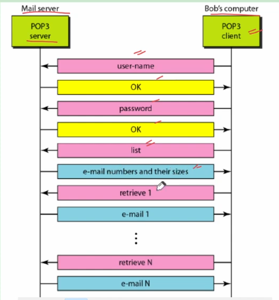

## Electronic Mail
- At the beginning of the Internet era, the messages sent by electronic mail were short and consisted of text only. Today, electronic mail is much more complex. It allows a message to include text, audio, and video. It also allows one message to be sent to one or more recipients.
### Architecture
- To explan the architecture of e-mail, we give **four scenarios.** we begin with the simplest situation and add complexity as we proceed. The foruth scenario is the most common in the exchange of email.
### First Scenario
- In the first scenario, the sender and the receiver of the email are users (or application programs) on the **same system;** they are directly connected to a shared system.

- The administrator has created one **mailbox** for each user where the received messages are stored. A mailbox is a part of **local hard drive**, a special file with permission restrictions.
- Only the owner of the mailbox has **access** to it.
- When Alice, a user, needs to send a message to Bob, Alice runs a **user agent** program to prepare the message and **UA itself** will store it in Bob's mailbox.
- The message has the sender and receipient mailbox addresses (names of files).
- Bob can retrieve and **read the content** of his mailbox at his convenience, **using a user agent**
- Consider UA is **Gmail interface.**
- The computer are directly connected to the mail servers.
- ***NOTE:*** When the sender and the receiver of an e-mail are on the same system, we need only two User Agents.
### Second Scenario
- Bob can retireve and **read the contents** of his mailbox at his convenince, **using a user agent.**

- Here if ALice is connected to google server
- Bob is connected to yahoo server
- Both are directly connected to the servers
- Alice sends mail to it's server which is stored in a **mail queue**to store messages waiting to be sent.
- MTA client keeps on checking the queue and when there is message then it will try to establish connection with MTA server and when connection is established then it pick the messages from queue and send them over internet to MTA server which is running at system from which Bob is connected.
- MTA server after receiving messages will store them at mail box of Bob.
- Like most client/server programs on the Internet, the server needs to run all the time because it don't know when a client will ask for a connection.
- Bob also needs a **user agent** program to retrieve messages stroed in the mailbox of the system at server site.
- ***NOTE:*** Here we need a pair of User Agents as well as a pair of Message Transfer Agents.
### Third Scenario
- Here receiver is directly connected to mail server but the sender is not directly connected to the mail server.

- Either Alice is connected to the system via point-to-point WAN, such as a dial-up modem, a DSL, or a cable modem; or connected to a LAN in  an organisation that uses one mail server for handling e-mails-all users need to send their messages to this mail server.
- Alice still needs a user agent to prepare message. Then needs to send the message through the LAN or WAN. This can be done through a pair of message transfer agents.
- Whenever Alice has a message to send, she calls the user agent which, in turn, calls the MTA client. The MTA client establishes a connection with the MTA server on the system, which is running all the time.
- The mail server computer at Alice's site manages all messages received and makes a mail queue. MTA client keeps on checking this queue and whenever there are messages to send it establishes a connection with MTA server at Bob's site and sends the messages. This server receives the messages and stores it in Bob's mailbox.
- At his convenience, Bob uses his user agent to retrieve the message and reads it.
- ***NOTE:*** Here we need 2 User Agents and 2 pair(4) MTAs.
### Foruth Scenario
- Both the sender and receiver are not direclty connected to the mail server directly.  

- We can't use a MTA client at Bob computer MTA server at mail server computer. This is because MTA client **push program** which pushes the messages to MTA server, it can't pull message from the MTA server.
- Other option is use MTA server at Bob computer which is impossible as now Bob can't shut down computer because he doesn't know when message will arrive.
- Hence, we need another set of client/server agents which we call **Message Access Agents**.
- Unlike MTA client, MAA client is a **pull program** and it can pull messages from MAA server.
- So Bob uses MAA client to retrieve his messages. The client sends a request to the MAA server, which is running all the time, and requests the transfer of the messages.
- ***NOTE:*** Here, we require 1 pair of User Agents, 2 pair of MTAs and 1 pair MAAs.

## User Agent
- The first component of an electronic mail system is the user agent. It provide service to the user to make the process of sending and receiving a message easier. Best known example is **Microsoft Outlook.**
### Services Provided by User Agent
- A user agent is a software package that composes, reads, replies to, and forwards messages. It also handles mailboxes.
- Services:
  - Composing Messages
  - Reading Messages
  - Replying to messages
  - Forwarding messages
  - Handling mailboxes
### User Agent Types
1. Command-Driven:
   - Command-driven user agents belong to the early days of email. They are still present as the underlying user agents in servers.
   - A command-driven user agent normally accepts a **one-character** command from the keyboard to perform it's task. For example, a user can type the character **r**, at the command prompt, to **reply to the sender of the message**, or type character **R** to **reply to the sender and all recipients of the message.**
   - Some examples of command driven UA are **mail,pine and elm.**
2. GUI-Based:
   - Modern user agents are GUI-based. They contain graphical-user interface component that allow the user to interact with the software by using both the keyboard and the mouse.
   - They have graphical components such as icons, menu bars, and windows that make the services easy to access.
   - Some examples of GUI-based UA are **Eudora,Microsoft's Outllok, and Netscape.**
### Addresses
- To deliver mail, a mail handling system must use an addressing system with unique addresses. In the Internet, the address consists of two parts: **a local part and a domain name, seperated by an @ sign.**
### MIME
- Email has a simple structure. Its simplicity, however, comes at a price. It can send messages only in **7-bit ASCII** format.
- In other words, it has some limitations. For example, it cannot be used for languages that are not supported by 7-bit ASCII characters(such as French, German, Hebrew, Russian, Chinese, and Japanese).
- Also, it cannot be used to send **binary files or videos or audio data**
- **Multipurpose Internet Mail Extensions** is a supplementary protocol that allows **non-ASCII data** to be sent through email.

- MIME transforms non-ASCII data at the sender site to ASCII data and delivers them to the client MTA to be sent through the Internet. The message at the receiving side is transformed back to the original data.
- We can think of MIME as a set of software functions that **transforms non-ASCII data (stream of bits) to ASCII data and vice versa.**
- MIME allows seven different types of data like audio, video, image etc.

## Message Transfer Agent: SMTP
- The actual mail transfer is done through message transfer agents. To send mail, a system must have the client MTA, and to receive mail, a system must have a server MTA.
- The formal protocol that defines the MTA client and server in the Internet is called the **Simple Mail Transfer Protocol (SMTP).** As we said before, two pairs of MTA client/server programs are used in the most common situation (fourth scenario).
- SMTP is used **Two Times**, between the **sender and the sender's mail server** and between **sender mail server and receiver mail server.**
  - Scenario 1: 0
  - Scenario 2: 1
  - Scenario 3: 2
  - Scenario 4: 2
- ***It is a connection oriented protocol and uses TCP with port number 25***
- SMTP simply defines how commands and responses must be sent back and forth. MTA client sends the command and server sends the responses.
### SMTP Commands
1. HELO: This command is used by client to identify itself
2. MAIL FROM: Used by client to identify sender of the message
3. RCPT TO: Use by client to identify the intended recipient of the message.
4. DATA: Used to send the actual message
5. QUIT: terminates the message
6. RSET: aborts current mail transaction
7. VRFY: verify address of the recipient
8. NOOP: used by client to check the status of the recipient
9. TURN: Lets the sender and the recipient switch positions, whereby the sender becomes the recipient and vice versa.
10. EXPN: verify the existence of one or more mailboxes on the system.
11. HELP: asks the recipient to send information about the command sent as the argument.
12. SEND FROM: Specifies that the mail is to be delivered to the terminal of the recipient, and not the mailbox.
13. SMOL FROM: specifies that the mail is to be delivered to the terminal or the mailbox of the recipient.
14. SMAL FROM: specifies that the mail is to be delivered to the terminal and the mailbox of the recipient.

## Message Access Agent: POP and IMAP
- The first and the second stages of mail delivery use SMTP. However, SMTP is not involved in the third stage because SMTP is a **push protocol**; it pushes the message from the client to the server. In other words, the direction of the bulk: data is from the client to the server.
- On the other hand, the third stage needs a **pull protocol;** the client must pull messages from the server. The direction of the bulk data is from the server to the client. **The third stage uses a message access agent.**
- Currently two message access protocols are available: Post Office Protocol, version 3(POP3) and Internet Mail Access Protocol, version 4(IMAP4).

### POP3
- Post Office Protocol, version 3 is simple and limited in functionality. The client POP3 software is installed on the recipient computer; the server POP3 software is installed on the mail server.
- Mail access starts with the client when the user needs to download e-mail from the mailbox on the mail server.
- The client opens a connection to the server **on TCP port 110.**
- It then sends it's **user name and password** to access the mailbox. The user can then list and retrieve the mail messages, one by one.

- POP3 has two modes; **delete mode and keep mode.**
- In the delete mode, the mail is **deleted from the mailbox** after each **retrieval.** In the keep mode, the mail **remains in the mailbox** after retrival.
- The delete mode is normally used when the user is working at her permanent computer and can save and organize the received mail after reading or replying.
- The keep mode is normally used when the user accesses her mail away from her primary computer. The mail is read but kept in the system for later retrieval and organizing.
### IMAP4
- IMAP4 uses **TCP port number 143** and provides the following extra functions which are not provided by POP3.
  - A user can check the **e-mail header** prior to downloading.
  - A user can **search the contents** of the e-mail for a specific string of characters prior to downloading.
  - A user can **partially download e-mail.** This is especially useful if bandwidth is limited and e-mail contains multimedia with high bandwidth requirements.
  - A user can **create, delete, or rename** mailboxes on the mail server.
  - A user can create a **hierarchy of mailboxes** in a folder for e-mail storage.