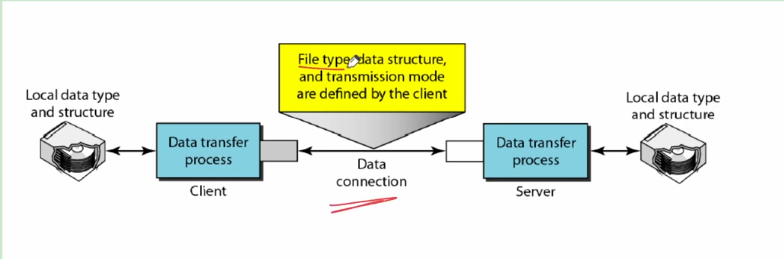

## File Transfer Protocol
- Transferring files from one computer to another is one of the most common tasks expected from a networking or internetworking environment. As a matter of fact, the greatest volume of data exchange in the Internet today is due to file transfer.
- **File Transfer Protocol** is the standard mechanism provided by TCP/IP for copying a file from one host to another.
- Although transferring files from one system to another seems simple and straightforward, some problems must be dealt with first. For example, two systems may use different file name conventions. Two systems may have different ways to represent tesxt and data. Two systems may have different directory structures. All these problems have been solved by FTP in a very simple and elegant aproach.
- FTP differs from other client/server applications in that it establishes **two connections between the hosts.** One connection is used for **data transfer,** the other for **control Information(commands and responses).**
- Seperation of commands and data transfer makes FTP more efficient.
- The control connection uses very simple rules of communication. We need to transfer **only a line** of command or a line of response at a time. The data connection, on the other hand, needs **more complex** rules due to the variety of data types transferred.
- However, the difference in complexity is at the **FTP level. not TCP.** For TCP, both connections are treated the same.

- FTP uses two well-known TCP ports: **Port 21** is used for the **control connection,** and **port 20** is used for the **data connection.**
- The client has **three components: user interface, client control process, and the client data transfer process.** The server has **two components: the server control process and the server data transfer process.** The control connection is made between the control processes. The data connection is made between the data transfer processes.
- The **control connection remains connected** during the entire **interactive FTP session.** The data connection is **opened and then closed for each file transferred.** When a user starts an FTP session, the control connection opens. While the control connection is open, the data connection can be opened and closed multiple times if several files are transferred.
### Communication over Control Connection
- FTP uses the **same approach as SMTP** to communicate across the control connection. It uses the **7-bit ASCII character set.**
- Communication is achieved through **commands and responses.**
- This simple method is adequate for the control connection because we send **one command (or response) at a time.**
- Each command or response is only one short line, so we need not worry about file format or file structure.
- Each line is terminated with a two-character(carriage return and line feed) **end-of-line token.**
### Communication over Data Connection
- File transfer occurs over the data connection under the control of the commands sent over the control connection. However, we should remember that file transfer in FTP means **one of three things:**
  - A file is to be copied from the server to the client. This is called **retrieving a file.** It is done under the supervision of the **RETR** command.
  - A file is to be copied from the client to the server. This is called **storing a file.** It is done under the supervision of the **STOR** command.
  - A **list of directory or file names** is to be sent from the server to the client. This is done under the supervision of the **LIST** command. Note that FTP treats a list of directory or file names **as a file.** It is sent **over the data connection.**
- Since 2 systems connected may not be using same file types so the client must define the type of file to be transferred, the structure of the data, and the transmission mode.
- Before sending the file through the data connection, we prepare for transmission through the control connection.

### File Type
- FTP can transfer one of the following file types across the data connection: **an ASCII file, EBCDIC file, or image file.**
- The **ASCII fie** is the **default format for transferring files.** Each character is encoded using 7-bit ASCII. The sender transforms the file from it's own representation into ASCII characters, and the receiver transforms the ASCII characters to it's own representation.
- If **one or both ends of the connection use EBCDIC encoding** (the file format used by IBM), the file can be transferred using EBCDIC encoding.
- The **image file is the default format for transferring binary files.** The file is sent as **continuous streams of bits without any interpretation or encoding.** This is mostly used to transfer binary files such as **compiled programs.**
### Data Strucutre
- FTP can transfer a file across the data connection by using one of the following interpretations about the strucutre of the data: **file structure, record structure, and page strucutre.**
- In **file structure** format, the file is **continuous stream of bytes.**
- In **record structure,** the fie is **divided into records.** This can be **used only with text files.**
- In **page structure,** the fiel is **divided into pages,** with each page having a page number and a page header.
- The pages can be stored and accessed randomly or sequentially.
### Transmission Mode
- FTP can transfer a fiel across the data connection by using one of the following three transmission modes: **stream mode, block mode, and compressed mode.**
- The **stream mode is the default mode.** Data are delivered from FTP tp TCP as a **continuous stream of bytes.** TCP is respomnsible for **chopping data into segments** of appropriate size. If the data are simply a stream of bytes, **no end-of-file needed** End-of-file in this case is the closing of the data connection by the sender. But the data are divided into records, each record will have a 1-byte end-f-record(EOR) character and the end of the file will have a 1-byte end-of-file(EOF) character.
- In block mode, data can be delivered from FTP to TCP **in blocks.** In this case, each block is preceded by a **3-byte header.** The first byte is called the **block descriptor;** the **next 2 bytes** define the **size of the block** in bytes.
- In the **compressed mode,** if the file is big, the data can be compressed. The compression method normally used is **run-length encoding.** In this method, consecutive appearances of a data unit are replaced by one occurence and the number of repititions. In a text file, this is usually spaces. In a binary file, null characters are usually compressed.
  - Run-length encoding: if there are 20 0's after 1 like 10000...000, then write it as 1200.
### Anonymous FTP
- To use FTP, a user needs an account and a password on the remote server.
- Some sites have a set of files available for public access, to enable anonymous FTP.
- To access these files, a user does not need to have an account or password. Instead, the user can use **anonymous as the user name and guest as the passowrd.**
- User access to the system is **very limited.** Some sites allow anonymous users only a subset of commands. For example, most sites allow the user to copy some files, but do not allow navigation through the directories.
### FTP Commands
#### Access Commands
1. USER: User information
2. PASS: Password
3. ACCT: Account information
4. REIN: Reinitialize
5. QUIT: Log out of the system
6. ABOR: Abort the previous command.
#### File Management Commands
1. CWD: Change to another directory
2. CDUP: Change to parent directory
3. DELE: Delete a file
4. LIST: List subdirectories or files
5. NLIST: List subdirectories of files without attributes
6. MKD: Create a new directory
7. PWD: Display name of current directory
8. RMD: Delete a directory
9. RNFR: Identify a file to be renamed
10. RNTO: Rename the file
11. SMNT: Mount a file system
#### Data formatting commands
1. TYPE: Define file type
2. STRU: Define organization of data
3. MODE: Define transmission mode
#### Port defining commands
1. PORT: Client chooses a port
2. PASV: Server chooses a port
#### File transfer commands
1. RETR: Retrieve files
2. STOR: Store files
3. APPE: Similar to STOR, if file exists then data must be appended
4. STOU: Same as STOR, but filename will be unique in dir.
5. ALLO: Allocate storage space for files at the server
6. REST: Position file marker at a specified data point
7. STAT: Return status of files
#### Miscellaneous commands
1. HELP: Ask information about the server
2. NOOP: Check if server is alive
3. SITE: Specify the site-specific commands
4. SYST: Ask about operating system used by the server