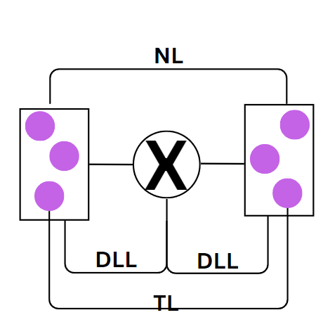
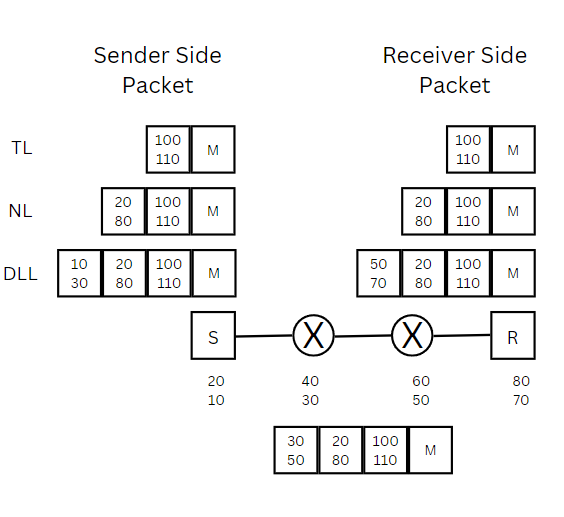
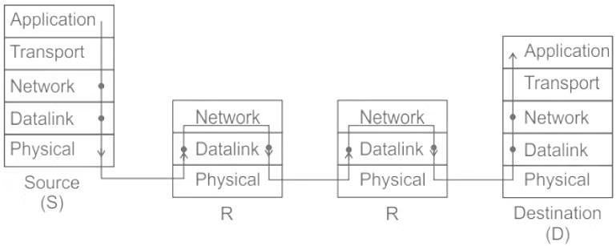

1. Physical Address
   - Unique address within LAN.
2. Logical Address
    - Unique address within Internet(Interconnected Network).
3. Port Address
    - Unique address to identify a process within a host(Computer).
4. 

- Data Link Layer is responsible for transferring data from one node to adjacent node.
- Network Layer is responsible for transferring data from one host to another host.
- Transport Layer is responsible for transferring data from one process to another process.

## Transfer of Packets From Sender to Receiver

- Below the Device given are Logical Address and Physucal Address.

### In the above Image how many times various Layers are accessed?

- The packet sent from sender goes to Router1.
  - Router1 sees that it has the Physical of himself so opens the packet and sees the Logical Address.
  - Router1 sees that the Logical Address is not of himself so he forwards the packet to Router2.
- Packet is sent to Router 2
  - Router2 sees that it has the Physical of himself so opens the packet and sees the Logical Address.
  - Router2 sees that the Logical Address is not of himself so he forwards the packet to Receiver.
- Receiver then opens the packet and sees the Logical Address.
  - Receiver sees that the Logical Address is of himself so he opens the packet and sees the Data.
 

- Here Sender and Receiver access all the layers once each.
- Router1 and Router2 access DLL and PL twice one for opening the packet and second for forwarding the packet.
- Router1 and Router2 access NL once for checking the logical address of the packet.
- TL is accessed once only by the Sender and Receiver.
- Hence DLL and PL are accessed 6 times and NL is accessed 4 times, Transport Layer is accessed only 2 times.
- **Generalised Formula**
  - DLL and PL are accessed 2n+2 times.
  - NL is accessed n+2 times.
  - TL is accessed only 2 times.
    - Where n is the number of routers in the path.
