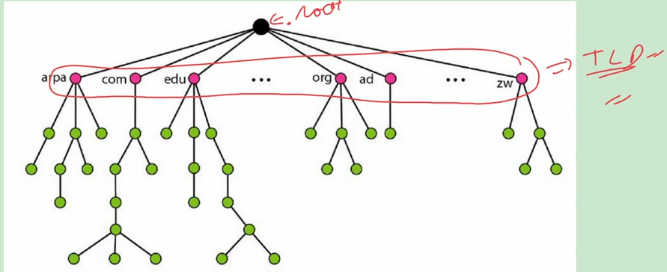
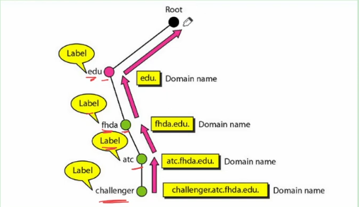

## Domain Name System
- To access information present on computer it was given an IP address.
- But human brain can remember names rather than numbers.
- So each computer is given a unique name and user uses this name to acces information
- Internally this name was mapped to IP address and for this mapping in early days hasts.txt file was used having two columns names and IP addresses.
- We can imagine that this process is similar to phonebook of mobile.
- This file was stored on every host connected to the internet and was periodically updated from master hosts.txt file which was stored at specific computer.
- Today however it is impossible to have one single host file to relate every address with name and vice versa because of two reasons:
  - Size of file will be very large
  - It is impossible to update changes in this file as this change must be broadcast to each and every host.
- Better Solution is to divide this huge amount of information into smaller parts and store each part on different computer.
- Same parts are stored on multiple computers to provide **fault tolerance**.
- Host that need mapping can contact **closest computer** holding that information.
- This method is known as DNS.
- It uses **distributed database** approach.
- It is an application layer protocol and uses **UDP** as transport layer protocol and port Number is **53**.

### Namespace
- We must assign a unique name to each IP address so that mapping become possible.
- Set of all these unique names which are assigned to IP address are called namespace.
#### Types of nameSpace
1. Flat namespace
   - As the name suggests there was **no link** between names and this was used in hosts.txt file
   - But it is very difficult to manage in today Internet as we need a **central authority** which will manage all these names and guanrantee there uniqueness.
2. Hierarchical Namespace
   - Each name is made of several parts.
   - The first part can define nature of organization, second can define the name of organisation and third can define departments in organization and so on.
   - So here Central authority will be responsible for assigning only nature and name of organisation and this organisation itself can assign names to its departments and computer inside departments.
   - So Central authority only **assign part of the name** and not the entire name for example nature is commercial (.com) and name is Cisco.
   - Now Cisco will give name to department like "sales" and give name to computer in slaes department as "abc".
   - Domain name of "abc" computer will be abc.sales.cisco.com
   - Also note that other organisations will also have "sales" department and can have computer name "abc" but as a whole domain name will be unique for example **abc.sales.cisco.com** and abc.**sales.tcs.com**

### Domain Name Space
- To have hierarchical namespace in DNS **domain name space** was designed.
- In this design the names are defined in **inverted tree** structure with the root on the top.

- The tree can have 128 level each node in a tree has a **label** which is a string of up to 63 characters.
- The root label is Null or empty string.
- DNS requires that children of a node have **different labels** which guanrantee uniqueness of domain names.
- A **domain name** is sequence of labels seperated by dots.
- Domain names are always read from the node up to the root and maximum size can be **255** characters and these are **case sensitive**.
  - Domain name is complete combining all the characters.

#### Domain name are of two types
1. Fully Qualified Domain Name
   - Domain name which **ends with null string** i.e. dot is called **fully qualified domain name** for e.g. "abc.sales.cisco.com"
   - An FQDN is a domain name that contains the full name of a host.
   - It contains all labels, from the most specific to the most general, that uniquely define the name of the host.
   - For example, the domain name: **challenger.atc.fuda.edu** is the FQDN of a computer named challenger installed at the Advanced Technology Center at De Anza College.
   - **A DNS server can only match an FQDN to an address**.
2. Partially Qualified Domain Name (PQDN)
   - Domain name which **does not ned with null string**.
   - PQDN starts from a node, but it does not reach the root.
   - It is **used when the name to be resolved belongs to the same site as the client**.
   - Here the resolver can supply the missing part, called the suffix, to create an FQDN.
   - For example, if a user at the fhda.edu site wants to get IP address of the challenger computer, he or she can define the partial name **challenger**.
     - We write only abc.sales
     - The resolver itslef solves and makes it abc.sales.cisco.com
   - The DNS client adds the suffix atc.fhda.edu. before passing the address to the DNS server.
   - The DNS client normally holds a list of suffixes, from them it adds the suffix.

## Question
How many . can be there at max in domain name

### Solution
- 127
- As there can be maximum 128 levels so, max 127 dots can be there. 

| FQDN | PQDN |
| ---- | ---- |
| challenger.atc.fhda.edu. | challenger.atc.fhda.edu |
| cs.hmme.com. | cs.hmme |
| www.funny.int. | www |