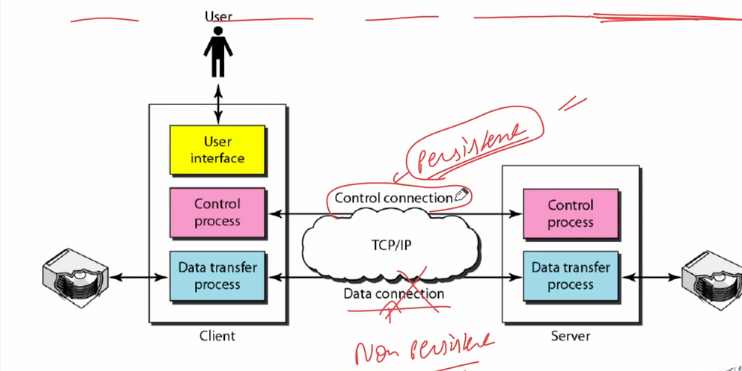
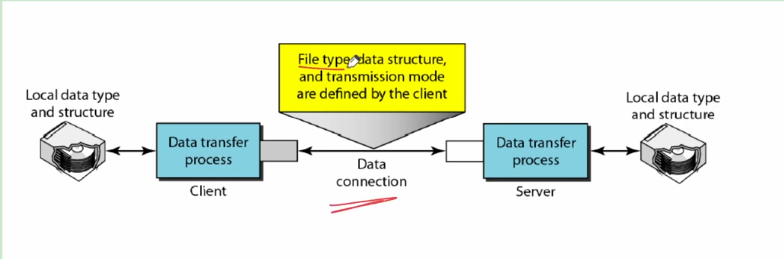

## File Transfer Protocol
- Transferring files from one computer to another is one of the most common tasks expected from a networking or internetworking environment. As a matter of fact, the greatest volume of data exchange in the Internet today is due to file transfer.
- **File Transfer Protocol** is the standard mechanism provided by TCP/IP for copying a file from one host to another.
- Although transferring files from one system to another seems simple and straightforward, some problems must be dealt with first. For example, two systems may use different file name conventions. Two systems may have different ways to represent tesxt and data. Two systems may have different directory structures. All these problems have been solved by FTP in a very simple and elegant aproach.
- FTP differs from other client/server applications in that it establishes **two connections between the hosts.** One connection is used for **data transfer,** the other for **control Information(commands and responses).**
- Seperation of commands and data transfer makes FTP more efficient.
- The control connection uses very simple rules of communication. We need to transfer **only a line** of command or a line of response at a time. The data connection, on the other hand, needs **more complex** rules due to the variety of data types transferred.
- However, the difference in complexity is at the **FTP level. not TCP.** For TCP, both connections are treated the same.

- FTP uses two well-known TCP ports: **Port 21** is used for the **control connection,** and **port 20** is used for the **data connection.**
- The client has **three components: user interface, client control process, and the client data transfer process.** The server has **two components: the server control process and the server data transfer process.** The control connection is made between the control processes. The data connection is made between the data transfer processes.
- The **control connection remains connected** during the entire **interactive FTP session.** The data connection is **opened and then closed for each file transferred.** When a user starts an FTP session, the control connection opens. While the control connection is open, the data connection can be opened and closed multiple times if several files are transferred.
### Communication over Control Connection
- FTP uses the **same approach as SMTP** to communicate across the control connection. It uses the **7-bit ASCII character set.**
- Communication is achieved through **commands and responses.**
- This simple method is adequate for the control connection because we send **one command (or response) at a time.**
- Each command or response is only one short line, so we need not worry about file format or file structure.
- Each line is terminated with a two-character(carriage return and line feed) **end-of-line token.**
### Communication over Data Connection
- File transfer occurs over the data connection under the control of the commands sent over the control connection. However, we should remember that file transfer in FTP means **one of three things:**
  - A file is to be copied from the server to the client. This is called **retrieving a file.** It is done under the supervision of the **RETR** command.
  - A file is to be copied from the client to the server. This is called **storing a file.** It is done under the supervision of the **STOR** command.
  - A **list of directory or file names** is to be sent from the server to the client. This is done under the supervision of the **LIST** command. Note that FTP treats a list of directory or file names **as a file.** It is sent **over the data connection.**
- Since 2 systems connected may not be using same file types so the client must define the type of file to be transferred, the structure of the data, and the transmission mode.
- Before sending the file through the data connection, we prepare for transmission through the control connection.
