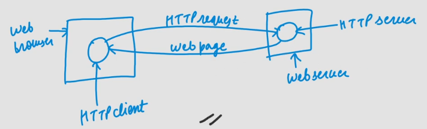

## Hyper Text Transfer Protocol
- Hyper Text: Clickable text
- HTTP is used to access webpages from webserver.
- Mainly used to access data on www[worldwideweb]

- HTTP is based on client/server model & uses TCP as transport layer protocol [ Port No: 80 ]
- HTTP doesn't have flow & error control mechanism so it rely on TCP for that.
- HTTP is **in band** protocol i.e. no seperate connection is made for commands [from only one connection commands & data are transferred]
- HTTP is "stateless" protocol i.e. it treats each request as an independent transaction which is unrelated to any previous request so here communication consist of independent pair of request & response.
- Server doesn't maintain any info about clients i.e. when did they last logged in, which pages visited, etc. [ because millions of users visit website so maintaining info needs lot of memory. ]
### Problem:
- If server doesn't maintain information about client then how server will display data of client interest
#### Solution
- Server creates a special text file called "cookie" & drop it on client computer. So whenever client visit the same server then it show the same cookie & hence server shows the content relevent to you.
### Cookie:
- Cookie is a small text file [ Not piece of code ] created by server & stored on client computer Hard Disk.
- It has certain life span & after that it is deleted automatically.
- It stores information about content viewed by client on website.
### Versions of HTTP
1. HTTP 1.0: Non-persistent connection (temporary)
   - For example a wegpage is fetched consisting of 2 images and 1 audio in it.
   - It then makes 4 connections, 2 for images, 1 for audio and 1 for the webpage, each object has seperate TCP connection to download that object and after downloading it is closed.
   - All these connections are made parallely hence between same client and server multiple connections are made.
   - Slow but load on server is less.
2. HTTP 1.1: Persistent connection (permanent)
   - For example a wegpage is fetched consisting of 2 images in it.
   - It creates only 1 connection for everything, even though it is fast then non-persistent[As seen in TCP congestion the WS keeps increasing exponentially allowing more data to come in].
   - More load on server as single connection and more bandwidth will be required.
### HTTP request Methods
- GET: read a webpage
- HEAD: read a webpage's header
- PUT: Store a Web page
- POST: Append to a named resource
- DELETE: Remove the Web page
- TRACE: Echo the incoming request
- CONNECT: Reserved for future use
- OPTIONS: Query certain options

### GATE Question based on this
- When a user clicks on a hyperlink, the browser carries out a series of steps in order to fetch the page pointed to. Suppose that a user is browsing the Web and finds a link on Internet telephony that points to ITU's home page, which is http://www.itu.org/home/index.html. Let us trace the steps that occur when this link is selected.
    1. The browser determines the URL
    2. The browser asks DNS for the IP address of www.itu.org.
    3. DNS replies with 156.106.192.32.
    4. The browser makes a TCP connection to port 80 on 156.106.192.32.
    5. It then sends over a request asking for file /home/index.html.
    6. The www.itu.org server sends the file /home/index.html.
    7. The TCP connection is released.
    8. The browser displays all the text in /home/index.html.
    9. The browser fetches and displays all images in this file.

#### Server
1. Accept a TCP connection from a client
2. Get the name of the file requested.
3. Get the file to the client.
4. Return the file to the client.
5. Release the TCP connection.