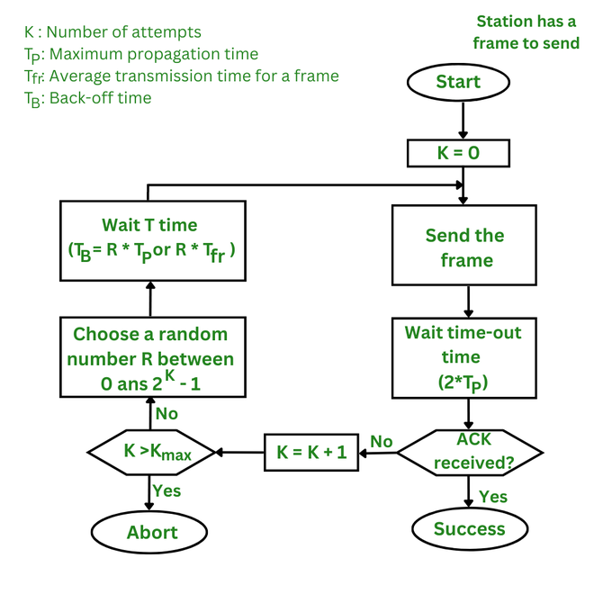

# Aloha

# Pure Aloha
- Aloha was invented in 1970s at the University of Hawaii
- It was originally developed for wireless LANs, but it is also used in shared medium wired LANs
- **ASSUMPTION:** Each Station sends frames of same size
- **WORKING:** Whenever station want to send data it can send on the channel, i.e. there is no fixed rule defined which will tell station when to sned data.
- Hence Colliision chances are very high.
- Sendser after sending data will wait for ACK from receiver.
- This waiting time is known as Time-out & is equal to minimum possible round trip time(2 * Tp) between two stations.
- After Time out, station will again send data but if it immediately tries to send data then collision will occur & time out will also be same. Hence no station can effectively send data.
- Now we need to take care of 2 things
  - Each Station must not send frame immediately after time-out.
  - Number of attempts must be fixed for each station(15).
- Station waits for a random amount of time called Back-off time.
  - $T_B$ = R * $T_{slot} \rightarrow$ $Tp, \; Tt, \; RTT(2 * Tp).$
  - R is a random number between 0 & $2^n$ - 1, where n is the number of collisions.
  - This is called Binary Exponential Back-off Algorithm.
  - Called Binary because we assume collision is just between 2 stations.

## Example 
Suppose A & B are sending data and their packets collide. Both have this as their first collision so both will wait for random amount of time.  

$T_B$ = R * $T_{slot}$
$R_A$ = 1, $R_B$ = 1

| A | B | Outcome |
| - | - | ------- |
| 0 | 0 | Collision |
| 0 | 1 | A wins the $1^{st}$ backoff |
| 1 | 0 | B wins the $1^{st}$ backoff |
| 1 | 1 | Collision |

Probability of collision is 1/2.  
Probability of A winning is 1/4.  
Probability of B winning is 1/4.  

Now Suppose A wins the $1^{st}$ backoff and A sends the data while B waits for it.  Now suppose A want to send it's second packet while B is sending it's first packet.

$T_B$ = R * $T_{slot}$
$R_A$ = 1, $R_B$ = 2

| A | B | Outcome |
| - | - | ------- |
| 0 | 0 | Collision |
| 0 | 1 | A wins the $2^{nd}$ backoff |
| 0 | 2 | A wins the $2^{nd}$ backoff |
| 0 | 3 | A wins the $2^{nd}$ backoff |
| 1 | 0 | B wins the $2^{nd}$ backoff |
| 1 | 1 | Collision |
| 1 | 2 | B wins the $2^{nd}$ backoff |
| 1 | 3 | B wins the $2^{nd}$ backoff |

Probability of collision is 2/8.  
Probability of A winning is 5/8.  
Probability of B winning is 1/8.  

Now According to probabilty, we can say A will now try to send it's third packet, while B is still stuck on it's first packet.  

Probability of collision is 1/8.  
Probability of A winning is 13/16.  
Probability of B winning is 1/16.  

We Are saying it as Expotential Back-off because probability of collision is decreasing exponentially.

## Flowchart

## Vulnerable Time
Vunerable time is the range of time in which collision can take place.  

Let Transmission Time is 2 ms. Suppose A Want to send data at 4 ms. Now if B sends data at even 2.001 ms then collision will occur. Similarly if B sends data at 5.999 ms then also collision will occur. Hence the range of time in which collision can occur is 2 ms to 6 ms.  
Range = $2 \times Tt$.  
Look here we have not considered propagation Time because Pure Aloha is mainly used in wireless networks and in Wireless networks propagation is negligible compared to transmission time.

## Throughput
S = $G \times e^{-2G}$  
G = Total number of frames sent by network(All stations) in 1 Tt.  

## Question
Frame size = 200 bits, B/W = 200 kbps, Find throughput if,
1. 1000 frames are genrated per sec
2. 500 frames are genrated per sec
3. 250 frames are genrated per sec

### Solution
G = Number of frames generated in 1 Transmission time.  
Transmission time = $\frac{Frame Size}{B/W}$ = $\frac{200}{200000}$ = 1 ms.  
1. G = 1, Throughput = $1 \times e^{-2}$ = 13.53%
2. G = 0.5, Throughput = $0.5 \times e^{-1}$ = 18.39%
3. G = 0.25, Throughput = $0.25 \times e^{-0.5}$ = 15.16%

## Note:
> When number of frames generated by network is half, throughput is maximum.

## Question 
Assuming 'n' stations are present in pure aloha network, having B/W of 56 kbps. Find value of 'n' assuming each station send data of size 1000 bits at an average interval of 100 s.

### Solution
Total Bandwidth = 56 kbps  
Bandwidth of each station = $\frac{1000}{100}$ = 10 bps, because each station sends data of size 1000 bits at an average interval of 100 s.  
Number of stations * Bandwidth of each station = Maximum Throughput  
$\therefore n \times 10 = 56000 \times 0.184$ = 10304

# Slotted Aloha
- In Slotted Aloha time is divided into slots each of size equal to transmission time.
- So if stations has to send data then it can send only at the beginning of the slot.
- For eg if transmission time is 2 ms & station has data to send at 2.001 ms then it has to wait for next slot i.e. 4 ms.
- In slotted Aloha collision can take place for example if three different stations have to send data at 2.1, 3.5 & 3.7 ms then all three will send data at 4 ms & collision will occur.
- Vulnerable time is now reduced to half i.e. $Tt$.

## Throughput
S = $G \times e^{-G}$

## Example
Frame size = 200 bits, B/W = 200 kbps, Find throughput if,
1. 1000 frames are genrated per sec
2. 500 frames are genrated per sec
3. 250 frames are genrated per sec

### Solution
G = Number of frames generated in 1 Transmission time.  
Transmission time = $\frac{Frame Size}{B/W}$ = $\frac{200}{200000}$ = 1 ms.  
1. G = 1, Throughput = $1 \times e^{-1}$ = 36.79%
2. G = 0.5, Throughput = $0.5 \times e^{-0.5}$ = 30.19%
3. G = 0.25, Throughput = $0.25 \times e^{-0.25}$ = 18.39%

## Note:
> When number of frames generated by network is 1, throughput is maximum.

## GATE 2007
'n' stations slotted LAN, Each station transmit with probablity 'p' in each time slot.
1. Probability that only one station transmits in a given time slot is?
2. What is the maximum probability of Success?

### Solution
1. For only one station to transmit in a given time slot, all other stations must not transmit in that time slot.  
If 4 stations then,
   - first sends and rest three not: p*(1-p)\*(1-p)\*(1-p)
   - second sends and rest three not: (1-p)*p\*(1-p)\*(1-p)
   - third sends and rest three not: (1-p)*(1-p)\*p\*(1-p)
   - fourth sends and rest three not: (1-p)\*(1-p)\*(1-p)*p
- Total probability = $4p(1-p)^3$
- For n stations, probability = $np(1-p)^{n-1}$

2. For maximum probability differentiating the above equation w.r.t. p and equating to 0.
    - $n(1-p)^{n-1} - np(n-1)(1-p)^{n-2} = 0$
    - $(1-p) - p(n-1) = 0$
    - $p = \frac{1}{n}$
$\therefore$ Maximum probability of success = $n(\frac{1}{n})(1-\frac{1}{n})^{n-1}$ = $(1-\frac{1}{n})^{n-1}$ = $\frac{1}{e}$ = 0.368  
Average Number of tries = $\frac{1}{p_{max}}$ = $e$ = $2.718$

## GATE 2015
LAN with 4 nodes. Time is divided into slots and each station can begin transmission only at the beginning of the slot. A collision is said to have occurred if more than one station transmit in the same slot. Probabiliteis of stations are 0.1, 0.2, 0.3 & 0.4. Probability of sending frame in slot one without collision.

### Solution
Probability of sending frame in slot one without collision = $0.1 \times 0.8 \times 0.7 \times 0.6$ + $0.9 \times 0.2 \times 0.7 \times 0.6$ + $0.9 \times 0.8 \times 0.3 \times 0.6$ + $0.9 \times 0.8 \times 0.7 \times 0.4$ = 0.44

