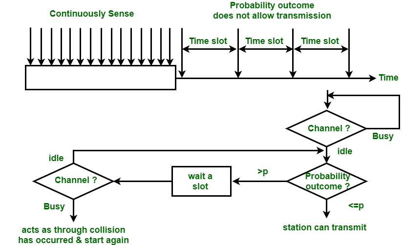

# Carrier Sense Multiple Access (CSMA)

- To minimize the chance of collision CSMA technique was developed. CSMA is based on principle of "Listen before you speak" or "Sense before you send".
- When A & D are communicating, C & D have to wait for A & D to finish their communication.
- The stations check for the idleness of the channel at the point through which they are connected to the channel.
- Their are still chances of collisions like if A is transmitting data to D, now since there will be propogation delay so their are chances that when C sense the channel due to propogation delay the bits sent by A may not have reached the point where C is connected to the channel, and C would find the channel as idle and start transmitting data to D, which will result in collision.
- Vulnerable time = Propogation delay

## Persistence Methods in CSMA
What should station do if channel is busy and what should station do if channet is idle?

### 1-persistent CSMA
- If channel is busy, station will keep on sensing the channel until it becomes idle and then transmits immediately.
- Probability of collision will be very high.
- If Bandwidth-Delay product is high, then collision probability will be high.
- Ethernet LAN uses 1-persistent CSMA.t
- If channel is idle, station transmits immediately.

### Non-persistent CSMA
- If channel is busy, station waits for a random amount of time and then senses the channel again, if again finds busy then again will wait for random amount of time and then sense the channel again, this process will continue until channel becomes idle and then transmits immediately.
- If channel is idle, station transmits immediately.
- This method reduces the efficiency of the network.
- Channel utilization is more than 1-persistent as chances of collision are less.

### p-persistent CSMA
- This method can be used if channel has time slots with slot duration equal to or greater than maximum propogation time.
- It uses advantages of both 1-persistent & non-persistent methods i.e. it reduces chances of collision as well as improves efficieny of the network.

- Senses the continuously if station finds the channel busy.
- As soon it finds the channel idle, it generates a random number between 0 & 1.
- If the random number is less than p, then station transmits immediately, where p is the probability of transmission, assigned to each station.
- If the random number is greater than p, then station waits for the next time slot and then senses the channel again.
- If the channel is idle, the process is repeated.
- If the channel is busy, the station will use backoff algorithm and act as collision has occured.

## Note:
> The less the value of p, the less the chances of collision and more the efficiency of the network i.e. Higher Throughput.  