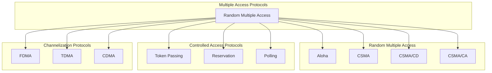

## Types of Multiple access Protocols

```mermaid
graph TD;
%% Random
    subgraph "Random Multiple Access"
        V[Aloha]
        W[CSMA]
        X[CSMA/CD]
        Y[CSMA/CA]
    end

%% Controlled
    subgraph "Controlled Access Protocols"
        P[Token Passing]
        Q[Reservation]
        R[Polling]
    end

%% Channel
    subgraph "Channelization Protocols"
        S[FDMA]
        T[TDMA]
        U[CDMA]
    end

%% Multiple
    subgraph "Multiple Access Protocols"
        A[Random Multiple Access]
    end

%% Edges
    A --> V
    A --> W
    A --> X
    A --> Y
    A --> P
    A --> Q
    A --> R
    A --> S
    A --> T
    A --> U
```