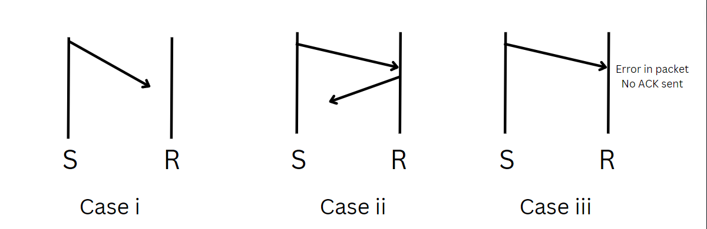
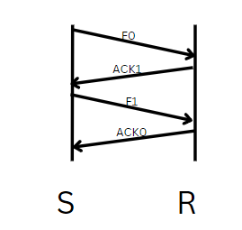

# Stop & Wait ARQ

- As the name suggest sender will send only one frame & waits for ACK from receiver.
- Sender will send next frame only after receiving ACK from receiver.
- Sender must maintain copy of frame & timer must be started after sending it when timer expires & No ACK from receiver then it retransmit the frame.

## Three Reasons for Re-Transmission
1. Frame is lost in the medium
2. Frame is received by receiver but ACK is lost in the medium.
3. Frame is received by the receiver but it is corrupted so receiver will silently discard the frame.

> Second Scenario Leads to duplicacy of the frame, Hence we need Sequence Number for frames.  
> Also, delay in ACK leads to missing of frames, hence we need to provide sequence number to ACK as well.
>> Missing frame scenario
>> - Sender sends frame 0 & waits for ACK.
>> - Receiver receives frame 0 & sends ACK 0 but it is lost in the medium.
>> - Sender retransmits frame 0 & waits for ACK.
>> - Receiver receives frame 0 & sends ACK.
>> - Sender receives ACK & sends frame 1 but it is lost in the medium.
>> - Meanwhile sender receives the earlier lost ACK and thinks that frame 1 is received by the receiver & sends frame 2.
>> - Due to this receiver misses frame 1.  
>
>> If number is given to ACK then sender will understand that received ACK was for older one which is already dealt with.

- If sender want to send 1000 frames then it wll need 10 bits of sequence number.
- So 10 bit overhead will be added to each frame.
- Since sender send only one frame at a time so better to use only one bit for sequence number.
- If frame 0 is received then ACK 1, if frame 1 is received then ACK 0 and so on.(Toggle the bit)

## Question
- If sender wnats to send 10 packets using stop & wait but every 5th packet is lost in medium then find no of packets sent by sender.

### Solution
- 1,2,3,4 goes smoothly, 5 is lost and sender retransmits it.
- 5,6,7,8 goes smoothly, 9 is lost and sender retransmits it.
- 9,10 goes smoothly.
- Total 12 packets are sent by sender.

## GATE 2006
- Probability of error is 0.2 on wireless medium. Average no. of transmission attempts required to transfer 100 packets using stop & wait ARQ.

### Solution
- As probablity is 0.2 so for every 10 packets sent 2 will be lost. So to send 10 packets actually we send 12 packets.
- Hence, to send 100 packets 120 packets needed to be sent, this extra 20 packets sent there is 0.2 probability of getting error and so 4 more packets needed to be shared.
- Formula:- $N + NP + NP^2 + NP^3 + ...$
  - = $N(1 + P + P^2 + P^3 + ...)$
  - = $N[\frac{1(1-P^n)}{1-P}]$ 
  - As, sum is upto infinity r <= 1
  - = $N(\frac{1}{1-P})$
  - = $100(\frac{10}{8})$
  - = 125 Packets