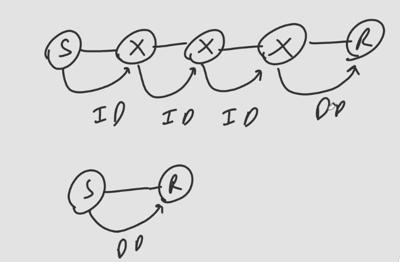
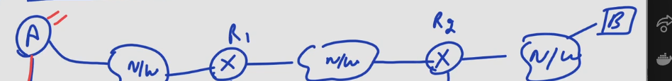

## Direct And Indirect Delivery

- If packet is reaching to receiver then it is called direct delivery.
- If packet is reaching to any intermediate router then it is called Indirect Delivery.
- Everytime there is exactly 1 direct delivery and there can be 0 to n-1 Indirect Delivery.

## Question
How router or host will check whether delivery is Direct or Indirect?

### Solution
- Host apply it's own netmask to it's IP address to find net id & it apply the same net mask with destination IP address to find net ID of destination.
- If both are same the delivery is direct else Indirect.

## Forwarding
- Forwarding means to place the packet in it's route to destination.
- Host or router have a routing table with the help of which they find the route to final destination.
- If delivery is direct then routing table is not needed rather IP address of destination is given to ARP to find the Physical addres.
- But incase of Indirect Delivery, routing table is needed to find IP addres of next Hop.

## Forwarding Techniques

1. ***Route Method***
- In Above image as shown, A sends data to B throught the route R1 and then R2. So according to this routing table of A is maintained.
- Routing Table of A
- ```
    | Destinantion |  Route  |
    |       B      | R1,R2,B |
    ```
- Routing Table of R1
- ```
    | Destinantion |  Route  |
    |       B      |   R2,B  |
    ```
- Routing Table of R2
- ```
    | Destinantion |  Route  |
    |       B      |    B    |
    ```
- **Disadvantages**
  - Too Many Entries: Number of Entries = Number of Hosts/Receivers
  - Too Big Table: The size of each entry is big as need to remember whole route
2. ***Next Hop Method***
- Same for the above Image, here the table entris will be as below
- Routing Table of A
- ```
    | Destinantion | Next Hop  |
    |       B      |     R1    |
    ```
- Routing Table of R1
- ```
    | Destinantion | Next Hop  |
    |       B      |     R2    |
    ```
- Routing Table of R2
- ```
    | Destinantion | Next Hop  |
    |       B      |     -     |
    ```
- **Disadvantages**
  - Too Many Entries: Number of Entries = Number of Hosts/Receivers
3. ***Network Specific Method***
- Here in the routing table instead of entry of each host we just store entry of network
- Then using netmask we find netID of host
- Then using it we route the packets.
- **Disadvantage**
  - Nowadays we have too many networks so again entries will increase
4. ***Default Method***
- we have entries of only directly connected local networks
- If networks over the Internet we have single entry that is to the default router connected to the Internet.
- Routing Table of A
- ```
    | Destinantion | Next Hop  |
    |       N2     |    R1     |
    |       N3     |    R2     |
    |   Any Other  |    R3     |
    ```
- Here R3 is the default router connected to Internet.