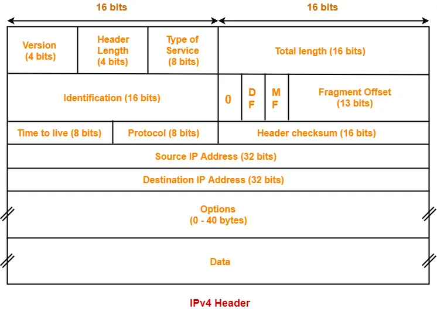

## IP Protocol
- It is unreliable & connectionless
  - Unreliable: No error checking or Tracking
  - Header contains a field called checksum but it is not for checking data, it is for checking the header.
- Provides the best effort delivery system.
- Each Datagram can be transported seperately and can follow different routes.

## IP Datagram
- Total Datagram Size (20 - 65535)
- Two parts
  1. Header (20 - 60)
  2. Data   (0 - 65515)
- Datagram is packed inside a frame
- If datagram is packed in Ethernet frame then maximum size will be 1500 bytes of data, as ethernet carries max of 1518 byte of data from which 18 bytes is for header.
- Minimum data requirement of Ethernet frame is 46 bytes but we can send 20 byte(As 20 is the minimum datagram size of IP) of data and adding 26 byte of padding to the data.
- Hence, Maximum padding done by Ethernet Layer is of 26 bytes.

## IP Header

- First 5 rows make up 20 bytes which is the minimum datagram size required by IP.
- VER(4 bits): tells the version of the IP.
  - Like IPv4, IPv6, etc.
- HLEN(4 bits): Defines the Header Length
  - 0101 * 4 = 20 bytes
  - 1111 * 4 = 60 bytes
  - Minimum number is 0101 as minimum size is 20 bytes.
  - Also, Header length is always multiple of 4.
- 