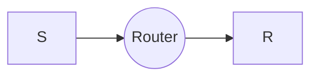

# Factors of Measuring Performance

## Bandwidth

- Bandwidth is the amount of data that can be transmitted over a network in a given amount of time. It is measured in bits per second (bps), kilobits per second (Kbps), or megabits per second (Mbps).
- It is also measured in terms of frequency (Hz) for cases of analog signals.

## Throughput

- Throughput is the actual amount of data that is transmitted over a network in a given amount of time. It is measured in bits per second (bps), kilobits per second (Kbps), or megabits per second (Mbps).

## Question
A network with bandwidth of 10 Mbps can pass an average of 12000 frames per minute with each frame carrying an average of 10,000 bits. What is the throughput of this network?

### Solution
- 10 Mbps = 10,000,000 bps
- 12000 frames per minute = 12000/60 = 200 frames per second
- 200 frames per second * 10,000 bits per frame = 2,000,000 bits per second
- Throughput = 2,000,000 bps

## Delay

- Delay is the amount of time it takes for a packet to travel from source to destination. It is measured in seconds or milliseconds.
- Delay is also called latency.

## Types of Delay

1. Propagation Delay
   - Propagation delay is the time taken by a bit to travel from one node to another.
   - $Time(T_{p}) = \frac{Distance}{Speed}$

2. Transmission Delay
   - Transmission delay is the time taken by a router to push out the bit of the packet onto the link.
   - $Time(T_{t}) = \frac{Packet Size}{Bandwidth}$

## Example
- Packet size = 1000 bits
- Bandwidth = 1 kbps
- Distance = 1000 m
- Speed = 200 m/s
- Propagation Delay = 1000/200 = 5 seconds
- Transmission Delay = 1000/1000 = 1 second
- Total Delay = 5 + 1 = 6 seconds for the first bit
- Total Time for the packet = 6 + 999 = 1005 seconds
- Throughput = 1000/1005 = 0.995 kbps
- Efficiency = 0.995/1 = 0.995 = 99.5%
- Utilization = 0.995/1 = 0.995 = 99.5%

3. Queuing Delay
   - There can be scenarios where the sender is sending packets at a faster rate than the receiver can process them. In such cases, the packets are queued at the receiver end. This delay is called queuing delay.
    - Queuing delay is the time taken by the packet to wait in the queue before it is processed.
    - It entirely depends on the traffic in the network.
4. Processing Delay
   - Processing delay is the time taken by the router to process the packet header.
  
> Total Delay = Propagation Delay + Transmission Delay + Queuing Delay + Processing Delay

## Question
Swnder wants to send a packet of size 10000 bytes to a receiver. S & R are connected via a router & $T_{p}$ and Bandwidth of each link is 1 ms and 1 Mbps respectively. Find total delay. Also assume that processing delay and queuing delay are 5 ms and 10 ms respectively.

### Solution

- Transmission Delay = 80000/1000000 = 0.08 seconds = 80 ms
- Sender will transmit first bit to router at 80 ms
- At 81 ms router will receive first bit
- 81 + 5 = 86 ms packet ready to be processed
- 86 + 10 = 96 ms packet processes by router and ready to be transmitted.
- 96 + 80 = 176 ms router will transmit first bit to receiver
- 176 + 1 = 177 ms receiver will receive first bit
- 177 + 5 = 182 ms packet ready to be processed
- 182 + 10 = 192 ms packet processes by receiver and ready to be transmitted.
- Total Delay = 192 + 80000 = 80192 ms