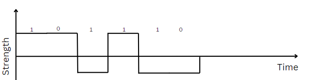

# Bit Rate

- Number of bits transmitted per second
- Measured in bits per second (bps)
- Bit rate is the rate at which information is transferred

# Baud Rate

- Number of signal units transmitted per second
- Measured in baud (Bd)
- Baud rate is the rate at which the signal changes
- For Digital signal, one signal unit is signal with constan amplitude.

- Here if all signal shown are transmitted in one second then,
- Baud rate = 6 bauds
- Bit rate = 6 bps

- Here if all signal shown are transmitted in one second then,
- Baud rate = 12 bauds
- Bit rate = 6 bps

## Note:-
> In case of Manchester encoding bit rate will be half of baud rate.  
> In case of NRZ-L bit rate = baud rate.

### For Case of analog signals, One signal unit is signal with same amplitude phase and frequency.

- Here if all signal shown are transmitted in one second then,
- Baud rate = 2 bauds
- Bit rate = 2 bps

- Here if all signal shown are transmitted in one second then,
- We used 2 bits each to represent one signal unit, because we have 4 different signal units with different amplitudes.
- Baud rate = 4 bauds
- Bit rate = 8 bps