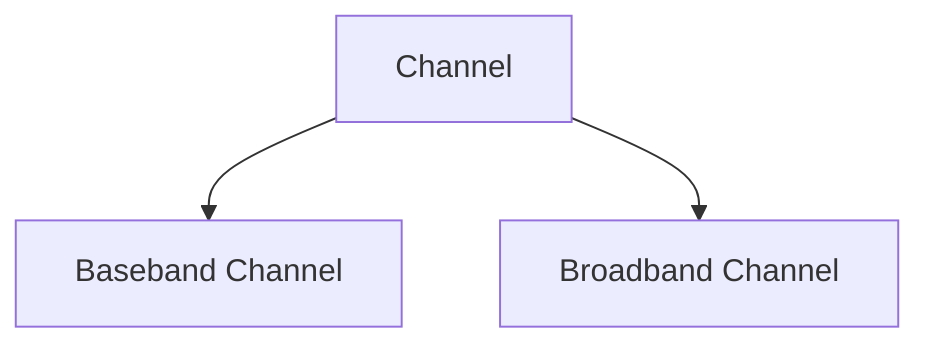

# Signal Encoding Techniques

**Signal encoding** is the process of converting data to signals. The data can be analog or digital. The signals are analog or digital depending on the type of data to be sent. For example, if the data is digital, the signals used to represent the data can be analog or digital.

- While transmitting data from sender to receiver they are connected with a broadband channel.

- Channel can be of 2 Types:

| Baseband Channel | Broadband Channel |
| --- | --- |
| Only one signal can be transmitted at a time | Multiple signals can be transmitted at a time |
|Digital Signal|Analog Signal|
|Collisions|No Collisions|

## Types of Encoding Techniques

1. Digital to Digital Conversion (Digital Data to Digital Signal)
   - Used to convert digital data transmitted by the sender to digital signals for transmission over a communication channel.

2. Digital to Analog Conversion (Digital Signal to Analog Signal)
   - Used to convert digital signals to analog signals so that the data can be transmitted through broadband media collision-free.

3. Analog to Digital Conversion (Analog Signal to Digital Signal)
    - Used to convert analog signals to digital signals so that further we can convert them to digital data.

4. Analog to Analog Conversion (Analog Signal to Analog Signal)
   - Broadband line goes under attenuation, so we need to regenerate the signal at a particular distance. This is done by converting the analog signal to analog signal.