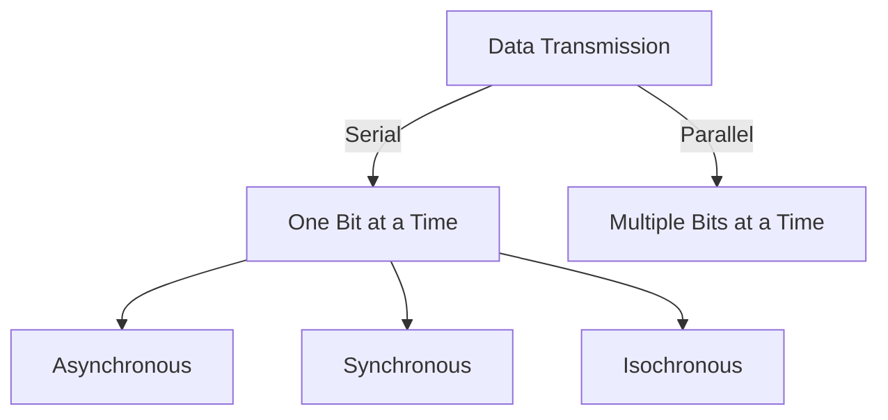
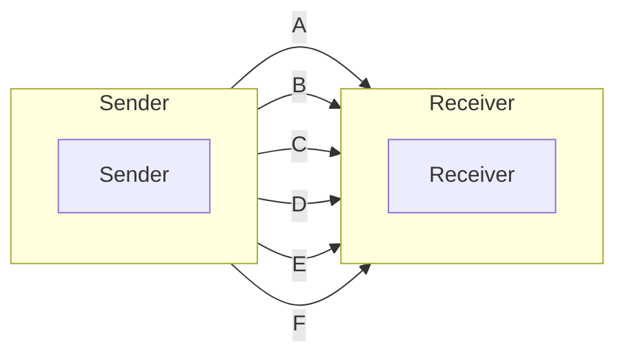
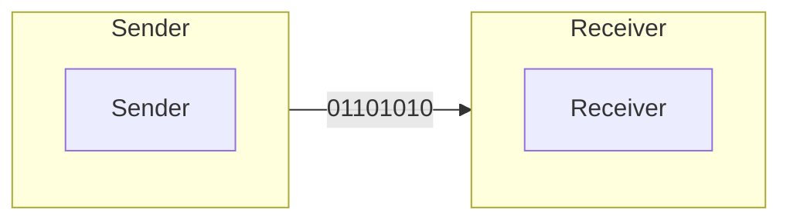

## Parallel Transmission

- Binary data is organized in groups of n bits each.
- Use n wires to send n bits at a time.
- It will take n times less time to send n bits but it will require n times more wires, so more expensive.

## Serial Transmission

- One bit follows another, so only one wire is required.
- It will take n times more time to send n bits but it will require n times less wires, so less expensive.

## Asynchronous Transmission

- Sender and receiver are not synchronized.
- Sender sends data in groups of bits, generally 8 bits.
- Sender and receiver are not synchronized at byte level i.e. Sender can send byte at any instant of time. To solve this problem, sender sends a start bit and a stop bit with each byte.
- At bit level both sender and receiver are synchronized.
- Sender sends a start bit (0) to indicate the start of a byte and a stop bit (1) to indicate the end of a byte. So, in place of 8 bits, 10 bits are sent.
- Example: Communication between a keyboard and a CPU.

## Synchronous Transmission

- Sender and receiver are synchronized.
- Data is transmitted as an unknown string of 0s & 1s without any start or stop bit called a frame.
- Receiver has to seperate that string of 0s & 1s into bytes and then into characters.
- Example: Communication between a CPU and a printer.
- There can be uneven gaps between frames.

## Isochronous Transmission

- Sender and receiver are synchronized.
- For real time applications like audio and video, it is necessary that the data is transmitted at a constant rate.
- Here, the sender sends a frame at a constant rate.
- Entire bit stream or data must be synchronized.

## GATE 2004
- $T_{1}$ $\Rightarrow$ Serial Transmission uses 8 info bits, 2 start bits, 1 stop bit and 1 parity bit for each character.
- $T_{2}$ $\Rightarrow$ Synchronous Transmission uses 3, 8 bit sync characters followed by 30,8 bit info characters.
- Bit rate = 1200 bits/sec for both $T_{1}$ and $T_{2}$.
- Transfer Rate in characters/sec for $T_{1}$ and $T_{2}$ are??

### Solution
- For $T_{1}$, 12 bits are sent for each character.
  - $Bit Rate = 1200 bits/sec$
  - $Transfer Rate = \frac{1200}{12} = 100$ characters/sec
- For $T_{2}$, $30 \times 8 = 240$ bits are sent for each character.
  - $3 \times 8 = 24$ bits are sent for each sync character.
  - Total bits sent for each character = $240 + 24 = 264$
  - $Bit Rate = 1200 bits/sec$
  - $Transfer Rate = \frac{1200}{264} \times 30 = 136.36 \approx 136$ characters/sec

## GATE 2004
- How many 8 bit characters transmitted per sec over a 9600 baud serial communication link using asynchronous mode of transmission with 1 start bit, 8 data bits, 1 parity bit & 2 stop bits.

### Solution
- In Serial Communication, bit rate = baud Rate.
- 9600 baud = 9600 bps
- 1 character = 8 + 1 + 1 + 2 = 12 bits
- Number of characters $= \frac{9600}{12} = 800$ characters/sec

## GATE 2008
- How many bytes of data can be sent in 15 seconds over a serial link with baud rate of 9600 in asynchronous mode with odd parity and two stop bits in the frame?

### Solution
- 9600 baud = 9600 bps
- As Asynchronous mode is used, We must have minimum 1 start bit and 1 stop bit
- Given, 2 stop bits and odd parity are used.
- So, total bits in a frame = 1 + 8 + 1 + 2 = 12 bits
- Total bits sent in 15 seconds = $9600 \times 15 = 144000$ bits
- Total frames sent in 15 seconds = $\frac{144000}{12} = 12000$ frames or characters