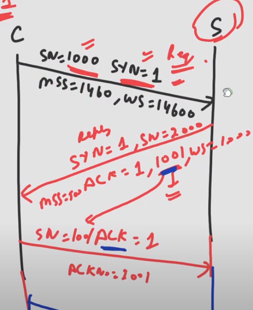

## TCP connection is made by 3 way handshaking
- First client sends the request packet
- Then server sends the reply packet which is nothing but ACK and connection request from server side.
- Finally client sends the ACK packet.  

### Request Packet
- Client initiate the connection but the server doesn't.
- Client chooses a random number [ Initial Sequence Number ] to start the connection.
- Request packet contain only header and no data & in this header SYN flag is set to 1.
- Sequence number of the SYN packet will be equal to ISN i.e. 1000.
- Maximum segment size is set to 1460 by client in options of request packet, because we assume ethernet is used as DLL protocol.
- 14600 bytes buffer is allocated to client side so window size field is set to value 14600
- Since MSS is 1460 & window size is 14600 at client side, so server get an idea that it can send atmost 10 segments each of maximum size 1460.
### Reply Packet
- Server send reply packet in which ACK flag is set to 1.
- ACK number will be 1001, i.e. Sequence Number expected ny the server.
- Server also chooses a random number [Initial Sequence Number] to send the data, because TCP works in full duplex mode.
- Similar to Request, Reply packet also constain only header & no data as well as in header SYN flag is set to 1.
- Sequence number of the reply packet will be equal to ISN i.e. 2000.
- MSS is set to 500 by server in options of reply packet.
- 10,000 bytes buffer is allocated at server side, so window size will contain value 10,000.
- By MSS and window size client come to know it can send atmost 20 segments with max size 500 bytes.
- Althoguh client can receive segment og max size 1460 but server can't send segment of size more than 500.
### ACK Packet
- The client send ACK packet to the server and ACK no. will be 2001 i.e. sequence number next expected by client.
- Sequence number of ACK packet will be 1001.
- Whenever SYN flag is set, one Sequence Number is consumed.
- Unlike Request and reply packet, ACK packet can contain data from client side, because server has sent ACK for connection req. of client in reply packet itself hence connection has been established from client to server.
- For detail analysis we will assume ACK packet does not contain any data.
- Since ACK packet is pure acknowledgement only so it will not consume any sequence number.

### Note
> Except first packet sent from client to server, every packet contain ACK = 1.  
> Pure ACK at third step do not consume any sequence number.

## Summary
| SYN | ACK | Function |
| --- | --- | -------- |
|  1  |  0  | Request Packet |
|  1  |  1  | Reply Packet |
|  0  |  1  | ACK/Data Packet |
|  0  |  0  | Reset Connection |
- For GATE purpose consider 0 0 as invalid state.