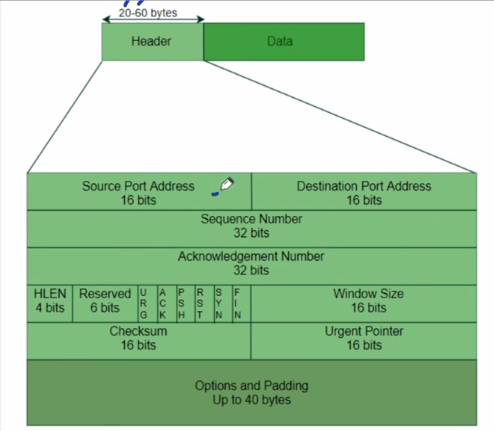

## Transmission Control Protocol
- It is connection oriented and reliable protocol.
- TCP works in full-Duplex mode.
- TCP is byte stream protocol i.e. every byte of data is numbered but IP is packet stream protocol i.e. every packet [ Datagram ] is numbered [ID field].
- Unlike UDP, TCP can be used to send large messages i.e. chopping of large message into segments can be done by TCP.
### Connection
- It is virtual connection & not physical i.e. segments of TCP may follow different paths, some of them may lost or duplicated or arrive out of order because they are encapsulated in IP datagram.
- Resources like buffer are allocated to client and server in advance before starting transmission.
- The buffers used are circular buffers.
### Reliable
- TCP has both flow and error control.
- For flow control there will be byte oriented sliding window protocol.

## TCP Header ⭐⭐⭐
- Minimum 20 bytes and maximum 60 bytes.

- Source Port address 16 bit field used to identify application program in host sending the segment.
- Destination Port address 16 bit field used to identify application program in host receiving. the segment.
### Sequence Number
- 32 bit field
- As TCP is byte-oriented so every byte transmitted is numbered.
- Sequence number is the byte no. of 1st byte carried in the segment.
  - Suppose a 5 byte data is sent in a segment, each byte having numbers 500,502,502,503,504
  - Now the sequence number will be byte number of first byte i.e. 500.
- TCP works in full duplex mode i.e. both parties can send data to each other.
- During connection establishment both parties uses random number generator to create Initial sequence no., which is usually different in each direction.
  - Random because, if everytime we start with let's say 0, and data of 50 bytes is sent.
  - First segment has seq: 0
  - Second has seq: 50
  - Third has seq: 100, but this got lost
  - Fourth has seq: 150
  - No third ACK would have come so resent third with seq: 100
  - Now connection is terminated.
  - Again both process communicate for some other purpose.
  - Again numbering start with 0, data of 50 bytes.
  - Two packets accepted by receiver.
  - This time if that seq: 100 packet which got lost came to receiver, it cannot differentiate whether it is new or old one.
  - Due to this sequence numbers are generated randomly.
- Since Sequence Number is of 32 bits so $2^{32}$ numbers are possible.
- Since each byte is numbered so max data that can be sent is 4GB & even if sender wnats to send 1 more byte then for that byte we have to reuse the byte number i.e. wrap around will occur.
### Wrap Around Time
- Time needed to use same byte number which is already used.
- It depends on Bandwidth.

## Question
Application program need to send 5000 bytes data, TCP divide it into 5 segments of equal size. Initial sequence number is 10,000. Find sequence number of 3rd segment. Also find ACK no. sent by receiver after receiving 2nd segment.

### Solution
- 5000 bytes data in 5 segments so each segment contain 1000 bytes.
- Initial sequence number is 10,000 so, first packet will have sequence number 10,001 and second segment will have sequence number 11,001 and Third segment will have sequence number 12,001.
- ACK number is byte number of last byte in segment + 1: Therefore ACK no. after receiving 2nd segment is 12,001.

## Question
If ACK No. is 'x' in TCP then this means receiver has received __ bytes.
1. x
2. x+1
3. x-1
4. none

### Solution
- As studied in last receiver sends ack of next expected number.
- But the sequence numbers are randomized so we can't say that if receiver ask for 12001 then 12000 bytes are received by the receiver.
- Hence answer will be none.

## Question
If ACK No. is 'x' and ISN is y in TCP then this means receiver has received __ bytes.
1. x-y
2. x-y-1
3. x-y+1
4. none

### Solution
- As studied in last receiver sends ack of next expected number.
- Here ISN is y which is initial randomized number, so we need to subtract that.
- Answer: x-y-1
  - If ISN:100
  - First segment: 101-200
  - Second segment no.: 201 (ACK after first)
  - Bytes received = 201-100-1 = 100 bytes

## Question
If ACK No. is 'x' and First segment no. is y in TCP then this means receiver has received __ bytes.

### Solution
- x-y because here it is talked about first segment not the ISN (establishment number).

## Question
Message: 1000 bytes. TCP send 4 segments of 100,200,400 & 300 bytes. Byte No. of 1st byte is 5000. What is ACK no. sent by receiver after receiving 3rd segment.

### Solution
- First segment: 5000 - 5099
- Second Segment: 5100 - 5299
- Third Segment: 5300 - 5699
- Forth Segment: 5700 - 5999
- ACK no. after receiving 3rd segment is 5700

## Question
If Bandwidth is 8mbps. Find Wrap around Time for TCP.

### Solution
-  $ 8 \times 10^{6}$ bits per second
-  $ 1 \times 10^{6}$ bytes per second
-  The wrap around will occur after sending 4GB data.
-  Thereofre, wrap around time: $\frac{2^{32}}{10^{6}} $ = 4294.9 seconds.

## GATE 2018
Consider a long lived TCP session with an end-to-end bandwidth of 1 Gbps. The session starts with sequence no. 1234. The minimum time(rounded to closest integer) before this sequence number can ne used again?

### Solution
- Answer: $\frac{2^{35}}{10^{9}}$ = 34.36 seconds
- Answer: 35 to clost integer, we took ceil value here as 34.3 is the least time required so to closest integer the time must be more than that.