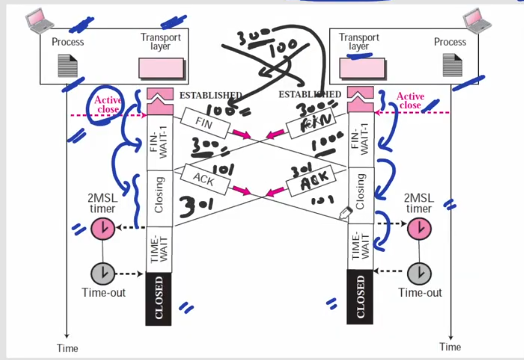

## TCP State Transition Diagram

### Transition States
| State | Description |
| ----- | ----------- |
| CLOSED | No connection exists |
| LISTEN | Passive open received; waiting for SYN |
| SYN-SENT | SYN sent; waiting for ACK |
| SYN-RCVD | SYN+ACK sent; waiting for ACK |
| ESTABLISHED | Connection established; data transfer in progess |
| FIN-WAIT-1 | First FIN sent; waiting for ACK |
| FIN-WAIT-2 | ACK to first FIN received; waiting for second FIN |
| CLOSE-WAIT | First FIN received, ACK sent; waiting for application to close |
| TIME-WAIT | Second FIN received, ACK sent; waiting for 2MSL time-out |
| LAST-ACK | Second FIN sent; waiting for ACK |
| CLOSING | Both Sides decided to close simultaneously |
### 3-Way handshaking Establishment and 4-way handshaking termination

- TCP has two types of Input, Local input and remote Input.
  - Active open, Active close, Passive open, etc. are local input
  - SYN+ACK, ACK, FIN, etc. are remote Input
  - SYN, ACK, etc. are output
- Look we can see that when client sent SYn the server is in LISTEN state and so replies with SYN+ACK.
- If server is in closed state, server replies with RST and says to reset the connection.
#### Client and Server Side series of States

- Closed(Active open/SYN) -> SYN-SENT(SYN+ACK/ACK) -> Established(Active Close/FIN) -> FIN-WAIT-1(ACK/-) -> FIN-WAIT-2(FIN/ACK) -> TIME-WAIT(Time-out) -> CLOSED
- Closed(Passive open/-) -> LISTEN(SYN/SYN+ACK) -> SYN-RCVD(ACK/-) -> ESTABLISHED(FIN/ACK) -> CLOSE-WAIT(Passive Close/FIN) -> LAST-ACK(ACK/-) -> CLOSED

### 3-way handshaking termination (Not much important)

- Here immediately the ACK+FIN is not sent rather server waits for some time.
- Packet is sent after passive close request from server process packet is sent.
- After the FIN+ACK received by the client, it immediately sends the ACK.

### Simultaneous Open (Rare Case)

- Here both Client and Server goes under SYN-SENT and SYN-RCVD state.
- Note that here the SYN+ACK packet has same sequence number as that of SYN.

### Simultaneous Close (Rare Case)

- Here after sending FIN the sender waits for ACK to come but instead a FIN comes that's why the sender goes to a new state CLOSING.
- Suppose peer1 sends FIN with ACK(last message) SeqNo: 100, ACKNo:500
- Peer2 on the same time sends FIN with ACK(last message) with SeqNo: 500, ACKNo: 100
- Here too the sender receives FIN+ACK, but here the ACKNo: 100, which the peer1 already sent
  - From this it understands that server has sent FIN+ACK before receiving the FIN sent by peer1.
  - Same is for the Peer2
  - Hence, they go to the CLOSING state instead of FIN-WAIT-2 or TIME-WAIT state.
- Now after sending ACK they both go to TIME-WAIT state.

### Time Out
- The time out time is 2 maximum segment lifetime, like if client sent ACK but not received by server than within 2MSL the server will again send FIN packet which indicates that the ACK packet sent by the client is lost.
  - Client resend the ACK and 2MSL timer is reset.
- To handle this lost packet cases of ACK after FIN client wait for 2MSL, if within 2MSL if FIN by server not comes, client understand that the packet might have reached the server and connection is successfully terminated.

## Question
Suppose Client sneds SYN but it does not reach to the server what state the client will be?

### Solution
- Doesn't matter about packet reached to server or not the state of client will be SYN-SENT.

## Note
> It does not matter whether the sent packet is received to opposite side or not, as soon as the source sends the packet it gets into the desired state.