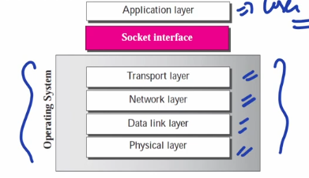
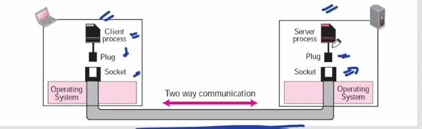
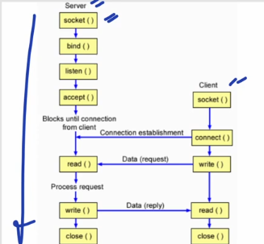
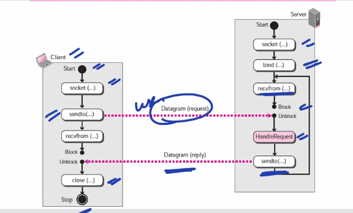

## Socket Interface for Unix
### System Call
- Whenever user program wants to use series of O.S. it has to do system call.
- It acts like an interface between user program & O.S.
- System call is a part of function call but it's definition is part of kernel.
### Socket Interface
- Collection of system calls which are used to interact with TCP/IP software.

### Socket

- A socket is a software abstract simulating a hardware socket we see in our daily life.
- To use the communication channel, an application program needs to request the operating system to create a socket.
- The application program then can plug into the socket to send and receive data.
- For data communication to occur, a pair of sockets, each at one end of communication, is needed.
### socket()
- The OS doesn't create a socket until instructed by the process. The process needs  to use the socket function call to create a socket.
### bind()
- To bind socket to local computer and local port, the bind function needs to be called.
- It attach (local IP + local Port) with the socket.
### listen()
- The listen function is called only be TCP server.
- After TCP has created and bind the socket, it must infor the OS that a socket is ready to receive client requests, done by listen function.
- It makes an unconnected active socket into a passive socket.
  - Means it will not go now anywhere to make connection but instead will wait for clients to request for connection.
### accept()
- Used by server to inform TCP that it is ready to receive connections from clients.
### connect()
- Connect function is used to add remote socket address structure.
- Used to make connection to remote server.
- If server process has not done accept() then it will return error message.
  - Meanwhile during that time process goes to blocked/waiting state.
### send() and recv()
- send() used to send data to remote machine
- recv() used to receive data from remote machine
- Used by TCP and not UDP.
### sendto() and recvfrom()
- Same as send() and recv() but here services of UDP are used.
### close()
- Used to close a socket.
- No more read and write to the socket.
- To have more control over socket closing shutdown() function can be used.
  - Apart from closing communication both ways like close(), it also allows to cut communication in certain direction as well.(Half Close)
  - FIN uses shutdown()⭐
  - RST uses close()⭐
## Sequence of TCP

## Sequence of UDP
