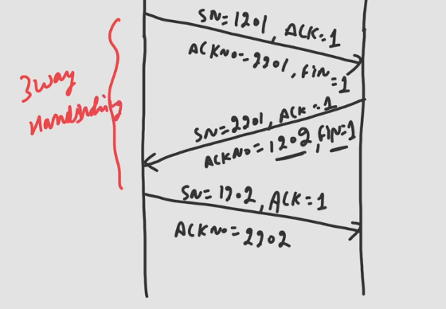

## Connection Termination
- Both parties act like peer, there is no one superior.
  - Hence, either client or server can terminate the connection.
- For connection termination FIN flag is used.
- Unlike TCP SYN packet, TCP FIN packet can contain data.
- Termination can be 3-way handshaking or 4-way handshaking.
### Three Way Handshaking

- Client sends FIN packet
  - Sequence number of this packet is same as previous one sent, because previous packet in data transfer was pure ACK.
  - SN:1201, ACK:1, ACKNo:2201, FIN:1
- Server sends back ACK with FIN flag set
  - SN:2201, ACK:1, FIN:1, ACKNo: 1202
- Client sends back pure ACK and connection is terminated.
  - SN: 1202, ACK:1, ACKNo:2202
- If client sends FIN packet with data say of 100 bytes.
  - SN:1201, ACK:1, ACKNo:2201, FIN:1
- Server sends back pure ACK and connection is terminated.
  - SN:2201, ACK:1, ACKNo:1302, FIN:1
  - Check here ACKNo:1302 instead of 1301 because we sent 100 byte data + 1 byte of FIN flag is also consumed hence, 101 bytes were sent.
### Four Way Handshaking

- Client sends FIN packet
  - Sequence number of this packet is same as previous one sent, because previous packet in data transfer was pure ACK.
  - SN:1201, ACK:1, ACKNo:2201, FIN:1
- Now, server still wants to send some data, so first it sends ACK but do not set FIN flag to 1 indicating that server currently don't want to terminate connection.
  - Server sends ACK, SN:2201, ACK:1, ACKNo:1202
- Server now sedns data, SN: 2202, ACK:1, ACKNo:1202
- Client in return sends pure ACK
  - SN:1202, ACK:1, ACKNo:2301
- Now Server wants to terminate the connection
  - SN:2301, ACK:1, ACKNo:1202, FIN:1
- Client sends back ACK
  - SN:1202, ACK:1, ACKNo:2302
- This is 4-way handshaking with half close.
#### 4-way handshaking used
- It is used in the case suppose client sends all of it's data one packet by packet while server doesn't reply with any req.
- Now, after data transferred client sends FIN packet to the server.
- Now, Server performs sorting of the packets, processes and sends back data and ACKs.
- Later after completion server sends FIN packet.
#### In case of 4-way
- Data C->S ❌
- Data S->C ✅
- ACK C->S ✅
- ACK S->C ✅ [Same ACK always]

## GATE 2021
Consider the three-way handshale mechanism followed during TCP connection establishment between hosts P and Q. Let X and Y be two random 32-bit starting sequence chosen by P and Q respectively. Suppose P sends a TCP connection request message to Q with a TCP segment having SYN bit = 1, SEQ number = X, and ACK bit =0. Suppose Q accepts the connection request. Which one of the following choice represents the information present in the TCP segment header that is sent by Q to P?
1. SYN bit =1, SEQ num = X+1, ACK bit =0, ACK num = Y, FIN bit =0
2. SYN bit =0, SEQ num = X+1, ACK bit =0, ACK num = Y, FIN bit =1
3. SYN bit =1, SEQ num = Y, ACK bit =1, ACK num = X+1, FIN bit =0
4. SYN bit =1, SEQ num = Y, ACK bit =1, ACK num = X, FIN bit =0

### Solution
- ACK bit is 0 and SYN bit is 1, means it is a request packet
- Now Q will send reply packet.
- ACK bit=1, SEQ num=Y, ACKNo = X+1, SYB bit=1;
- Option: C