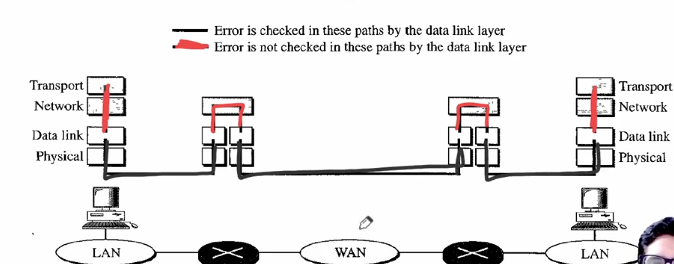
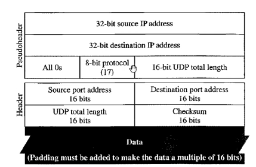

## User Datagram Protocol
- Is is a connectionless protocol, unreliable transport protocol.
- If a process want to sned a small message and does not care about reliability, it can use UDP.
- **Connectionless:** No need of connection establishment or connection release.
  - The packets are not numbered, they may be deleted or lost or may arrive out of sequence.
  - There is no acknowledgement either.
  - Path of packets to be sent is not fixed.
- Also data size is only that much which can be sent because here segmentation of data is not done.
- Unreliable means no need of flow and error control, it can be because of own error and flow control mechanism by application program or it needs fast service or the nature of the service does not demand flow and error control(real-time applications).
  - TFTP uses UDP because it has it's own error and flow control mechanism.
- We need error and flow control at transport layer because it is not provided at the network layer and DLL provides error and flow control between two nodes only. So what about end to end control, this is done by transport layer.
- 
- For flow sliding window is applied at transport layer as well, but here window is character oriented instead of frame-oriented.

> UDP has got limited error control.  
> Checksum is used in UDP but it is optional.

## User Datagram
- If we use UDP at transport layer then the packets are known as User Datagrams.
- Fixed header size of 8 bytes.
```
| Source Port Number | Destination Port Number |
| Total Length | Checksum | 
```
- All fields are of 16 bits/2 bytes.
  - If source is client then ephemeral port number, if source is server then well-known port number.
- Length defines the total length of the user datagram, header + data.
- Maximum Payload in UserDatagram = 65507
- Maximum length of User datagram = 65515
  - 20 bytes add on header by Network Layer
- UDP Length = IP Length - IP header
- Checksum detect error for whole datagram(header plus data).

### Checksum
- Checksum includes three sections: pseudoheader, UDP header and data.
- Pseudoheader is part of header of IP packet in which user datagram is to be encapsulated.
  - It is of 12 bytes.
  - Similar to last 12 fixed bytes of IP header.

- Pseudoheader is for double checking whether packet is delivered to the right host or not.
- We call it pseudoheader because it is not transferred.
- At sender, pseudoheader is created, checksum is calculated and discarded.
- At receiver, pseudoheader is recreated, checksum is calculated and discarded.
- UDP Data is paded if it is not multiple of 16.
- **After checksum calculation the pseudoheader and padding is discarded before sending user datagram to the IP.**
- If we don't want to calculate checksum we fill that field with all 1's.